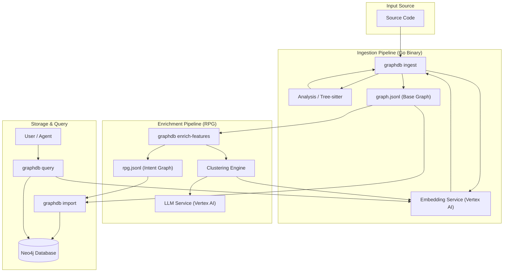

# GraphDB Skill Overview

## Executive Summary
The **GraphDB Skill** is a specialized subsystem within the Gemini CLI designed to modernize legacy codebases by creating a queryable knowledge graph. It bridges the gap between **static analysis** (structural dependencies) and **semantic understanding** (intent and meaning) using a hybrid approach:
1.  **Code Property Graph (CPG):** Captures explicit relationships like function calls, class definitions, and file organization using Tree-sitter parsers.
2.  **Repository Planning Graph (RPG):** An "Intent Layer" that clusters code into high-level features and concepts using Vector Embeddings (Vertex AI) and LLM-based summarization.

This allows developers to ask high-level architectural questions ("Where is the payment logic?") and low-level structural questions ("What breaks if I modify `processTransaction`?") in a single unified interface.

---

## System Architecture

The following diagram illustrates the data flow from raw source code to a queryable Neo4j database.



---

## Graph Schema

The GraphDB schema consists of two main layers: the **Physical Layer** (Code) and the **Logical Layer** (RPG/Intent).

```mermaid
erDiagram
    FILE {
        string id
        string path
        string name
    }
    
    FUNCTION {
        string id
        string name
        string content
        int line
        vector embedding
        list atomic_features
    }

    CLASS {
        string id
        string name
        string content
        int line
    }

    FEATURE {
        string id
        string name
        string description
        vector embedding
        string type
    }

    FUNCTION }|..|| FILE : DEFINED_IN
    CLASS }|..|| FILE : DEFINED_IN
    FUNCTION }|..|{ FUNCTION : CALLS
    FUNCTION }|..|{ CLASS : CALLS
    
    FEATURE ||--|{ FUNCTION : CONTAINS
    FEATURE ||--|{ FEATURE : PARENT_OF
    FEATURE ||--|{ FEATURE : RELATED_TO
```

### Node Types
*   **FILE**: Represents a physical file on disk.
*   **FUNCTION / METHOD**: Represents a callable unit of code. Contains the raw source code (`content`) and a vector embedding for semantic search.
*   **CLASS**: Represents a class or interface definition.
*   **FEATURE**: A logical grouping of functions/classes that represent a specific capability (e.g., "User Authentication", "Data Export"). These are generated during the `enrich-features` phase.

### Edge Types
*   **DEFINED_IN**: Links code entities to the file they reside in.
*   **CALLS**: Represents a static function call detected by Tree-sitter.
*   **CONTAINS**: Hierarchical relationship where a Feature contains Functions or other sub-Features.
*   **PARENT_OF / RELATED_TO**: Relationships between Features in the RPG layer.

---

## Component Breakdown

1.  **Ingest (`cmd/graphdb ingest`, `internal/ingest`)**:
    *   Orchestrates the crawling of the file system.
    *   Uses a worker pool to parse files in parallel.
    *   Delegates to `internal/analysis` for language-specific parsing (Go, TypeScript, etc.).
    *   Generates embeddings for function names/bodies.

2.  **Analysis (`internal/analysis`)**:
    *   Wrappers around `tree-sitter` parsers.
    *   Extracts definitions (Nodes) and calls (Edges).
    *   Currently supports: Go, TypeScript, Java, C#, C++, Python (implied capability).

3.  **RPG (`internal/rpg`)**:
    *   **Builder**: Constructs the feature hierarchy.
    *   **Clusterer**: Groups functions either by directory structure (`FileClusterer`) or semantic similarity (`EmbeddingClusterer`).
    *   **Enricher**: Uses LLMs to generate descriptions and summaries for clusters.

4.  **Loader (`internal/loader`)**:
    *   High-performance Neo4j bulk importer.
    *   Handles `UNWIND` operations for batched writes.
    *   Manages database wiping and schema constraints.

5.  **Query (`internal/query`)**:
    *   Abstracts Neo4j Cypher queries.
    *   Performs vector similarity search (combining Neo4j vector index or in-memory comparison if needed).
    *   Implements complex traversals like "Impact Analysis" and "Seam Detection".
