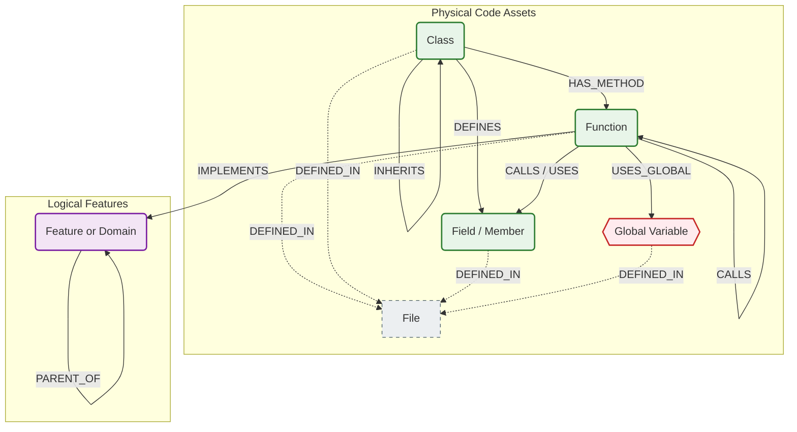

# GraphDB Skill Overview

## 1. Graph Schema Definition
In this project, the "schema" is not defined in a single SQL-like file because Neo4j is schemaless. Instead, the schema is the **contract** between the **Ingestion Pipeline** (Producers: `internal/analysis`, `internal/rpg`) and the **Query Engine** (Consumers: `internal/query/neo4j.go`).

The graph consists of two distinct layers:

### A. The Physical Layer (Code Structure)
Represents the actual code on disk. These nodes and edges are generated by the Tree-sitter parsers.

*   **Nodes:**
    *   `File`: A physical file on disk.
    *   `Function`: A function or method definition.
    *   `Class`: A class, struct, or interface definition.
    *   `Field`: A member variable or property within a class (Java, C#, TS).
    *   `Global`: A global variable or static field (state).

*   **Edges:**
    *   `(:Class)-[:HAS_METHOD]->(:Function)`: Structural ownership.
    *   `(:Class)-[:DEFINES]->(:Field)`: Structural ownership of fields.
    *   `(:Function)-[:CALLS]->(:Function)`: Direct function invocation.
    *   `(:Function)-[:CALLS]->(:Field)`: In some languages (Java), field access is modeled as a call/usage.
    *   `(:Function)-[:USES_GLOBAL]->(:Global)`: **Critical.** Represents code reading/writing global state.
    *   `(:Class)-[:EXTENDS|INHERITS|IMPLEMENTS]->(:Class)`: Inheritance relationships.
    *   `(*)-[:DEFINED_IN]->(:File)`: Links all code entities to their source file.

### B. The Intent Layer (RPG)
Represents the architectural "why". These nodes are generated by the RPG Builder (`internal/rpg`).

*   **Nodes:**
    *   `Feature`: A logical grouping of code (e.g., "User Authentication", "Billing"). There is no single "Project Root" node; instead, there are multiple top-level "Domain" features.

*   **Edges:**
    *   `(:Feature)-[:PARENT_OF]->(:Feature)`: Hierarchical composition (Domains -> Categories -> Features).
    *   `(:Function)-[:IMPLEMENTS]->(:Feature)`: Links the physical code to the logical feature it supports.

---

## 2. Visual Representation

The following diagram depicts the actual relationships found in the `internal/query/neo4j.go` implementation and `internal/analysis` parsers.

## 3. Key Concepts & Edge Logic

*   **Global State Tracking (`USES_GLOBAL`):**
    *   **Definition:** This edge is created when a function reads from or writes to a variable defined outside its local scope (and not passed as an argument).
    *   **Usage:** The `globals` query uses this to answer "What global state does `ProcessOrder` touch?" and "What functions mutate `InventoryCache`?".

*   **Member Access:**
    *   Parsers extract Class Members as `Field` nodes. In Java, accessing a field `obj.myField` is often modeled as a `CALLS` relationship to the `Field` node or a `USES` relationship, allowing dependency tracing through state, not just behavior.

*   **Feature Mapping (`IMPLEMENTS`):**
    *   **Definition:** Links low-level code to high-level intent.
    *   **Usage:** This allows queries like `explore-domain` to start at a high-level Feature (e.g., "Auth") and find all contributing functions, even if they are scattered across different files.

*   **Seams & Risks:**
    *   The `impact` and `seams` queries rely on the `CALLS` graph to calculate "Contamination". If a function touches a UI component or a database, that "risk" propagates up the `CALLS` edges to its callers.

---

## 4. The Ingestion Pipeline

The transition from raw code to a queryable knowledge graph occurs in four distinct phases. This pipeline is designed to be deterministic where possible (parsing) and probabilistic where necessary (intent understanding).

### Phase 1: Extraction (Parsing)
*   **Mechanism:** A high-performance Go binary (`graphdb extract`) uses a worker pool to walk the file system in parallel.
*   **Parsing:** Uses **Tree-sitter** bindings to generate a Concrete Syntax Tree (CST) for every file.
*   **Graph Construction:**
    *   **Nodes:** Extracts structural entities: `File`, `Class`, `Function`, `Field`, `Global`.
    *   **Edges:** Identifies relationships: `HAS_METHOD`, `DEFINES`, `INHERITS`, `CALLS`, `USES`.
*   **Resolution:** Performs **Systemic Resolution** on the fly, resolving imports (e.g., `using System;`, `import java.util.*;`) to link types across file boundaries.

### Phase 2: Embedding (Vectorization)
*   **Mechanism:** The pipeline isolates function bodies and signatures.
*   **Model:** Sends text to Google's Vertex AI (configured via `GEMINI_EMBEDDING_MODEL`, e.g., `text-embedding-004` or `gemini-embedding-001`).
*   **Storage:** The resulting 768-dimensional vectors are stored as properties on `Function` nodes, enabling semantic search and clustering.

### Phase 3: RPG Construction (Intent Generation)
This phase builds the "Intent Layer" (RPG) on top of the physical code.

1.  **Atomic Feature Extraction:** An LLM analyzes each function to extract a "Verb-Object" descriptor (e.g., "validates email", "hashes password").
2.  **Semantic Clustering:** The **EmbeddingClusterer** uses K-Means++ on the function vectors to group code with similar semantic meaning, regardless of directory structure.
3.  **Summarization:** An LLM generates a concise name and description for each cluster (e.g., "User Authentication").
4.  **Linking:** Creates `IMPLEMENTS` edges connecting the physical `Function` nodes to the new logical `Feature` nodes.

### Phase 4: Loading (Persistence)
*   **Format:** The pipeline emits a stream of JSONL records (Nodes and Edges).
*   **Ingestion:** The `graphdb import` command reads the JSONL stream.
*   **Batching:** Uses Cypher `UNWIND` clauses to batch-insert thousands of records per transaction into Neo4j, ensuring high throughput and transactional integrity.
