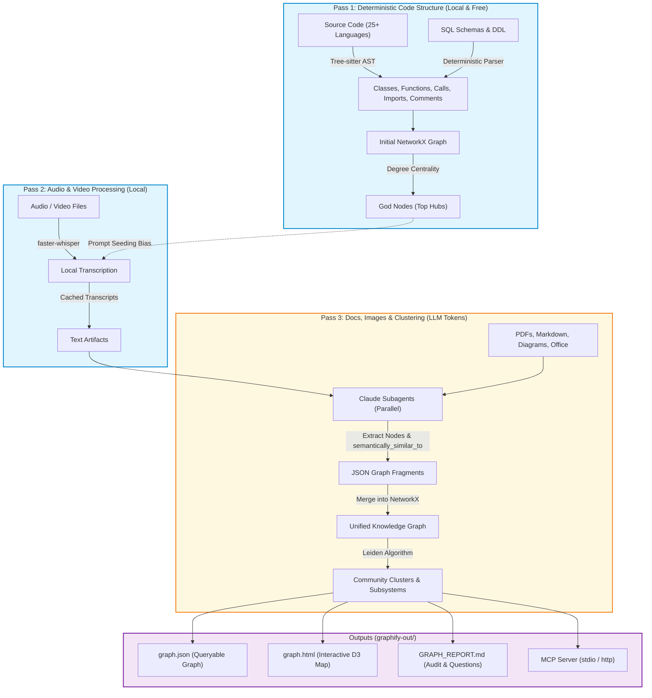
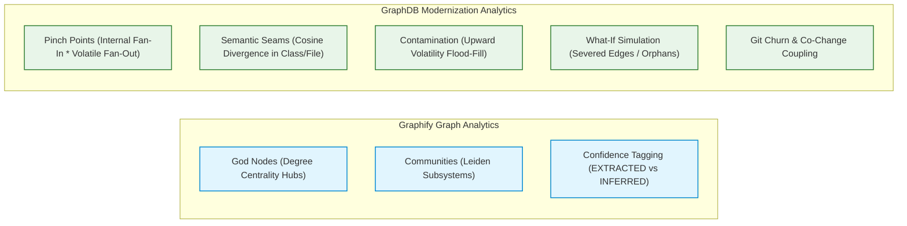

# Architectural Deep Dive: Graphify vs. GraphDB Skill

A comprehensive technical comparison between **Graphify** ([`Graphify-Labs/graphify`](https://github.com/Graphify-Labs/graphify)) and the **GraphDB Skill** ([`jjdelorme/graphdb-skill`](file:///home/jasondel/dev/graphdb-skill/README.md)).

---

## 1. Executive Summary & Positioning Matrix

| Dimension | **Graphify (v8)** | **GraphDB Skill** |
| :--- | :--- | :--- |
| **Primary Mission** | **Multimodal Knowledge Graph Engine for AI Assistants**<br>Gives LLMs (Claude Code, Cursor, Aider) a fast, structured map across code, docs, images, and audio/video to bypass text-grepping. | **Enterprise Legacy Modernization & Refactoring Ecosystem**<br>Provides deep structural CPG, vector semantics, intent hierarchies, and risk analysis for the Gemini CLI & Antigravity Agent Swarms. |
| **Core Philosophy** | *"Graph structure IS the similarity signal."*<br>Avoids vector embeddings for clustering by relying on topological community detection (Leiden) over unified code and doc edges. | *"Hybrid Triad: Structure + Semantics + Intent."*<br>Fuses deterministic ASTs (Tree-sitter), dense vector embeddings (`gemini-embedding-001`), and an AI intent layer (RPG). |
| **Target Codebases** | Modern polyglot repositories, research codebases, mixed documentation/media archives (25–40 languages). | Massive enterprise legacy monoliths (C++, C#, Java, VB.NET, ASP Classic, TypeScript, Python, SQL) with global state and high technical debt. |
| **Graph Storage Backend** | **In-memory NetworkX (Python)**<br>Static file outputs (`graph.json`, `graph.html`, `GRAPH_REPORT.md`). Optional Cypher export script. | **Neo4j 5.x Community Edition (Property Graph)**<br>ACID persistence, native Cypher query engine, and integrated 768d Vector Index. |
| **Clustering Approach** | **Leiden Community Detection**<br>Topological edge-density clustering over extracted code calls + LLM semantic similarity edges. | **K-Means++ on Dense Vectors (768d)**<br>Embeds LLM-extracted verb-object descriptors; LLMs hierarchically name and summarize Domains and Features. |
| **Refactoring & Modernization** | High-degree hub detection (**"God Nodes"**). | **Feathers Modernization Suite**<br>Pinch Points (structural seams), SRP divergence (semantic seams), Contamination risk propagation, Churn/Co-change coupling, What-If simulation. |
| **Multimodal Ingestion** | **First-class**: Local audio/video (`faster-whisper`), PDFs, diagrams/images (Claude Vision), docx/xlsx, Google Docs. | **Code & Git Centric**: Tree-sitter parsers, Git commit history, and test runner conventions. |
| **Execution Engine & Runtime** | Python (3.10+) CLI (`uv tool install graphifyy`), MCP stdio/HTTP server (`graphify.serve`). | High-performance compiled **Go binary** (`graphdb`) with CGO Tree-sitter, cross-compiled for Linux and Windows. |
| **AI Agent Integration** | **Model Context Protocol (MCP)**<br>Exposes `query_graph`, `get_node`, `get_neighbors`, `shortest_path`. | **Gemini Skill & Antigravity Agent Swarm**<br>Scout ([`scout.md`](file:///home/jasondel/dev/graphdb-skill/.gemini/agents/scout.md)), Architect, Engineer, Auditor via `plan-commands` Protocol Lifecycle. |

---

## 2. High-Level Architecture Comparison

### Graphify Architecture (3-Pass Pipeline)

Graphify processes codebases through a lightweight, sequential 3-pass pipeline that emphasizes local-first parsing and multimodal enrichment:



---

### GraphDB Skill Architecture (6-Phase Modernization Pipeline)

The GraphDB Skill operates an enterprise pipeline combining structural AST extraction, vector indexing, hierarchical intent modeling, and graph-theoretic risk propagation:

```mermaid
flowchart TD
    subgraph Phase1 ["Phase 1: Ingestion (High-Performance Go CLI)"]
        Src["Source Files (C++, C#, Java, VB.NET, TS, SQL)"] -->|CGO Tree-sitter| TS["AST & Symbol Resolution"]
        TS -->|Extract Entities & Behavioral Edges| JL["Streaming JSONL Output"]
    end

    subgraph Phase2 ["Phase 2: Loading & Indexing"]
        JL -->|Cypher UNWIND Batch Loader| N4J[("Neo4j 5.x Database")]
        N4J -->|Create Constraints & Vector Indexes| N4J
    end

    subgraph Phase3 ["Phase 3: RPG Construction (Intent Layer)"]
        N4J -->|Slice Function Code| Ext["Sub-step 3a: LLM Atomic Extraction (Verb-Object + Volatility)"]
        Ext -->|Vertex AI Batch / Inline| Emb["Sub-step 3b: Vector Embedding (gemini-embedding-001 768d)"]
        Emb -->|K-Means++ & Cosine Distance| Clust["Sub-step 3c: Semantic Clustering & Hierarchy"]
        Clust -->|LLM Domain / Feature Naming| Summ["Sub-step 3d: LLM Architectural Summarization"]
        Summ -->|Write Domain & Feature Topology| N4J
    end

    subgraph Phase4 ["Phase 4: Contamination & Risk Propagation"]
        N4J -->|is_volatile Seeds| Flood["Upward Flood-Fill on CALLS"]
        Flood -->|Distance Decay + Fan-In/Fan-Out + Churn| Risk["Composite Risk & Seam Calculation"]
        Risk -->|Pinch Points & Hotspots| N4J
    end

    subgraph Phase5 ["Phase 5: Temporal & Test Enrichment"]
        GitLog["Git Commit History"] -->|Compute Churn & Co-Change| N4J
        Tests["Test Suites"] -->|Convention Linker (TESTS)| N4J
    end

    subgraph Delivery ["Delivery & Agent Execution"]
        N4J --> WebUI["Embedded Web Visualizer (Port 8080)"]
        N4J --> CLIQuery["Unified Query Engine (17 Query Types)"]
        CLIQuery --> ScoutAgent["Scout Agent / Antigravity Swarm"]
    end

    classDef proc fill:#e8f5e9,stroke:#2e7d32,stroke-width:2px;
    classDef storage fill:#f3e5f5,stroke:#7b1fa2,stroke-width:2px;
    classDef agent fill:#fff3e0,stroke:#e65100,stroke-width:2px;
    class Phase1,Phase4,Phase5 proc;
    class Phase2,Phase3 storage;
    class Delivery agent;
```

---

## 3. Deep-Dive Pipeline & Algorithmic Comparison

### 3.1 Code Ingestion & AST Extraction

| Feature | **Graphify (Pass 1)** | **GraphDB Skill (Phase 1)** |
| :--- | :--- | :--- |
| **Parsing Engine** | Python Tree-sitter bindings. | Compiled Go binary with CGO Tree-sitter bindings ([`walker.go`](file:///home/jasondel/dev/graphdb-skill/internal/ingest/walker.go)). |
| **Language Breadth** | ~25–40 languages (broad coverage). | Targeted legacy & modern stack: C++, C#, Java, VB.NET, ASP Classic, TypeScript, Python, SQL ([`internal/analysis/`](file:///home/jasondel/dev/graphdb-skill/internal/analysis)). |
| **Scope & State Analysis** | Extracts classes, functions, calls, imports, inline comments. Flat representation. | Deep symbol resolution, constructor identification, Dependency Injection (DI) tracking, and lexical variable/global state usage (`USES_GLOBAL`, `DEFINES`, `USES`). |
| **SQL Handling** | Deterministic extraction of tables, views, foreign keys, and JOIN relationships. | Tree-sitter SQL DDL parsing mapping tables, columns, constraints, and foreign key relations to code symbols ([`sql.go`](file:///home/jasondel/dev/graphdb-skill/internal/analysis/sql.go)). |
| **Test Detection** | Generic AST extraction. | Deterministic `is_test: true` tagging on test files and functions for downstream test coverage mapping. |
| **Output Format** | NetworkX in-memory graph. | Streaming JSONL with separation between CPU-bound parsing and I/O-bound database insertion. |

### 3.2 Semantic Clustering vs. Community Detection

This is one of the most significant theoretical divergences between the two projects:

#### **Graphify: Leiden Community Detection on Unified Graph Topology**
* **Theory:** Graphify adopts the **Leiden algorithm** (an advancement over Louvain) from complex network analysis. It optimizes graph modularity by finding densely connected node groups.
* **Mechanism:** Rather than embedding code into vector space, Graphify adds LLM-derived semantic edges (`semantically_similar_to`, `mentions`) from documentation and transcripts directly into the structural graph. Leiden then clusters code nodes based on the combination of AST calls/imports and document co-mentions.
* **Pros:** 
  * Zero embedding API costs.
  * No vector database required.
  * Fast, deterministic clustering on graph topology.
* **Cons:** 
  * Code functions in different files that perform similar business logic (e.g., duplicated payment validators) will **not** cluster together unless they have direct structural edges or are co-mentioned in documentation.

#### **GraphDB Skill: K-Means++ Clustering on Dense Vector Space (RPG Intent Layer)**
* **Theory:** Implements the **Repository Planning Graph (RPG)** framework ([`GRAPHDB_OVERVIEW.md`](file:///home/jasondel/dev/graphdb-skill/GRAPHDB_OVERVIEW.md#L30-L41)). It treats low-level code implementation and high-level architectural intent as distinct layers.
* **Mechanism:** 
  1. **Atomic Extraction:** LLM reads each function body to generate domain-first "verb-object" descriptors (e.g., `authenticate-user`, `process-credit-card`) and flags volatility ([`extractor.go`](file:///home/jasondel/dev/graphdb-skill/internal/rpg/extractor.go)).
  2. **Vectorization:** Encodes descriptors using `gemini-embedding-001` (768 dimensions) ([`vertex.go`](file:///home/jasondel/dev/graphdb-skill/internal/embedding/vertex.go)).
  3. **K-Means++ Clustering:** Calculates domain size $K = \sqrt{N/5}$, seeds centroids maximally across vector space using K-Means++, and converges into clusters ([`cluster_semantic.go`](file:///home/jasondel/dev/graphdb-skill/internal/rpg/cluster_semantic.go#L128-L251)).
  4. **Hierarchical Naming:** Generates explicit `Domain` and `Feature` nodes in Neo4j with `PARENT_OF` and `IMPLEMENTS` edges.
* **Pros:** 
  * Captures latent conceptual relationships even across completely isolated files or disconnected legacy silos.
  * Creates a human-navigable, business-aligned domain hierarchy.
* **Cons:** 
  * Requires LLM token budget and GCP Vertex AI / Custom LLM credentials.

---

### 3.3 Architectural Analysis, Risk & Seam Detection



#### **Graphify's Analysis Tools:**
1. **God Node Identification:** Uses degree centrality to pinpoint major hubs/bottlenecks.
2. **Confidence Tagging:** Tags edges as `EXTRACTED` (hard AST truth) or `INFERRED` (LLM-derived with confidence score 0.0–1.0).
3. **Graph Report:** Generates architectural summaries and open questions in `GRAPH_REPORT.md`.

#### **GraphDB Skill's Modernization Tools (The Feathers Suite):**
1. **Contamination Analysis ([`neo4j_contamination.go`](file:///home/jasondel/dev/graphdb-skill/internal/query/neo4j_contamination.go)):**
   - Detects boundary functions touching I/O, UI, DB, or network (`is_volatile: true`).
   - Propagates volatility upward through the `CALLS` graph.
   - Calculates distance-decay volatility: $\text{score} = \frac{1}{\text{distance} + 1}$.
   - Computes composite risk score: $\text{risk} = 0.4 \cdot \text{fan\_in} + 0.1 \cdot \text{fan\_out} + 3.0 \cdot \text{volatility\_score} + 0.4 \cdot \text{churn}$.
2. **Structural Seams / Pinch Points ([`neo4j.go`](file:///home/jasondel/dev/graphdb-skill/internal/query/neo4j.go#L657-L742)):**
   - Identifies ideal locations for interface extraction and mocking.
   - Ranked by $\text{Internal Fan-In} \times \text{Volatile Fan-Out}$.
3. **Semantic Seams / Divergence ([`neo4j_semantic_seams.go`](file:///home/jasondel/dev/graphdb-skill/internal/query/neo4j_semantic_seams.go)):**
   - Measures pairwise cosine similarity of function embeddings within the same Class or File.
   - Flags functions with similarity $< 0.5$ as Single Responsibility Principle (SRP) violations.
4. **Impact & What-If Simulation ([`neo4j_whatif.go`](file:///home/jasondel/dev/graphdb-skill/internal/query/neo4j_whatif.go)):**
   - Simulates hypothetical node removals for Strangler Fig migrations, calculating severed edges and newly orphaned subsystems.
5. **Git Churn & Co-Change ([`neo4j_history.go`](file:///home/jasondel/dev/graphdb-skill/internal/query/neo4j_history.go)):**
   - Mines `git log` to find files frequently committed together, exposing hidden temporal coupling missed by static analysis.

---

## 4. Query Interfaces & Ecosystem Integration

### 4.1 Graphify Interaction Model
* **CLI & Logs:** Run `graphify query "what connects auth to db?"` (queries logged to `~/.cache/graphify-queries.log`).
* **Interactive UI:** Generates standalone `graphify-out/graph.html` using force-directed layout with community color-coding.
* **MCP Integration:** Serves tools over `stdio` or `http`:
  * `query_graph`: Natural language search across graph entities.
  * `get_node`: Inspect node attributes and connections.
  * `get_neighbors`: Traverse incoming/outgoing relationships.
  * `shortest_path`: Find structural paths between distant components.
* **Consumer:** AI coding assistants (Claude Code, Cursor, Aider) invoke MCP tools to navigate the codebase without stuffing flat files into context.

### 4.2 GraphDB Skill Interaction Model
* **CLI Query Engine ([`cmd_query.go`](file:///home/jasondel/dev/graphdb-skill/cmd/graphdb/cmd_query.go)):** Provides 17 specialized query commands:
  * `search-features`, `search-similar`, `duplicates`, `neighbors`, `coverage`, `hybrid-context`, `impact`, `what-if`, `hotspots`, `globals`, `seams`, `semantic-seams`, `locate-usage`, `fetch-source`, `explore-domain`, `traverse`, `cypher`, `status`.
* **Embedded Web Visualizer ([`cmd_serve.go`](file:///home/jasondel/dev/graphdb-skill/cmd/graphdb/cmd_serve.go)):** Full HTTP server on port 8080 with interactive D3 graph rendering, domain tree explorer, and live search.
* **Smart Headless TTY Detection:** Suppresses spammy progress bars during agent runs, emitting logs at 10% increments to protect LLM context windows.
* **Agent Integration:** Native integration with the **Scout Agent** ([`scout.md`](file:///home/jasondel/dev/graphdb-skill/.gemini/agents/scout.md)), **Antigravity Multi-Agent Swarms**, and the `plan-commands` Protocol Lifecycle.

---

## 5. Summary of Key Strengths & Trade-offs

| Capability | **Graphify (v8)** | **GraphDB Skill** | Winner / Best Suited |
| :--- | :--- | :--- | :--- |
| **Setup Friction & Portability** | Zero infrastructure (Python package, in-memory NetworkX, local JSON/HTML files). | Requires Neo4j instance + Google Cloud / LLM API setup. | **Graphify** for instant zero-dependency onboarding. |
| **Multimodal Ingestion** | Natively parses audio/video (`faster-whisper`), PDFs, architecture images, Office docs, Google Docs. | Code and Git repository focused. | **Graphify** for multi-asset project documentation. |
| **Legacy Code Modernization** | Identifies top connected hub nodes ("God Nodes"). | Comprehensive Feathers suite: Pinch Points, SRP Semantic Seams, Contamination flood-fill, What-If simulation. | **GraphDB Skill** for deep legacy refactoring & migration. |
| **Enterprise Scale & Concurrency** | In-memory NetworkX; best for small-to-medium repos. | Neo4j ACID database + Vertex AI Batch API with GCS staging for 30k–100k+ file monoliths. | **GraphDB Skill** for large-scale enterprise repositories. |
| **Semantic Vector Search** | None (relies purely on graph topological community clustering). | Dual Vector Indexes on Functions and Features (768d `gemini-embedding-001`). | **GraphDB Skill** for semantic code similarity & duplicate detection. |
| **AI Assistant Protocol** | Model Context Protocol (MCP) compatible with any tool-calling client. | Gemini CLI Skill & Antigravity Swarm specialized. | **Graphify** for universal MCP; **GraphDB** for Antigravity swarms. |

---

## 6. Actionable Takeaways & Cross-Pollination Opportunities

### What GraphDB Skill Can Learn from Graphify:

1. **Multimodal Ingestion Pipeline (Pass 2 & Pass 3 Concept):**
   - GraphDB Skill currently focuses strictly on code and Git history. Adding an optional multimodal ingestion step for Architecture Decision Records (ADRs), whiteboard photos, design PDFs, or transcribed design meetings would enrich the RPG intent layer.
2. **Domain-Seeded Speech Transcription:**
   - Graphify's technique of using extracted code symbols ("God Nodes") as vocabulary bias for Whisper transcription is elegant. If GraphDB ingests developer recordings or standup transcripts, seeding with Domain/Feature names would ensure accurate domain-term transcription.
3. **Leiden Community Detection as a Pre-Filter:**
   - GraphDB could incorporate the Leiden algorithm as a fast, zero-token structural clustering pass to pre-segment massive graphs before running LLM-based K-Means++ semantic clustering, reducing LLM costs on huge codebases.
4. **Universal MCP Server Support:**
   - Exposing the `graphdb` Go binary as a standard Model Context Protocol (MCP) server (over `stdio` and `http`) alongside the existing Gemini CLI skill would allow developers to query GraphDB from Cursor, Claude Code, and VS Code MCP extensions.
5. **Static Artifact Generation:**
   - Adding a command to bundle the visualizer into a standalone static HTML report (like `graphify-out/graph.html`) would make it easier to share architectural snapshots across engineering teams without requiring an active Neo4j connection.

### What Graphify Can Learn from GraphDB Skill:

1. **Risk Contamination & Volatility Propagation:**
   - Distinguishing pure business logic from I/O boundary functions and propagating volatility along call chains provides high-value refactoring guidance that raw degree centrality cannot match.
2. **Structural & Semantic Seams (The Feathers Suite):**
   - Incorporating Pinch Point analysis ($\text{Fan-In} \times \text{Volatile Fan-Out}$) and SRP divergence analysis would allow Graphify to guide developers on exactly where to insert mocks and interfaces.
3. **What-If Impact Simulation:**
   - Simulating severed edges and orphaned nodes for planned deletions would elevate Graphify from a descriptive knowledge graph to an active refactoring planner.
4. **Git Churn & Co-Change Coupling:**
   - Adding temporal Git mining would reveal hidden dependencies between files that change together but lack static AST connections.
5. **Asynchronous Batching for Large Monoliths:**
   - Staging LLM prompts via cloud batch storage (GCS/S3) ensures robust execution for massive 50,000+ file enterprise codebases without hitting rate limits or timeouts.
