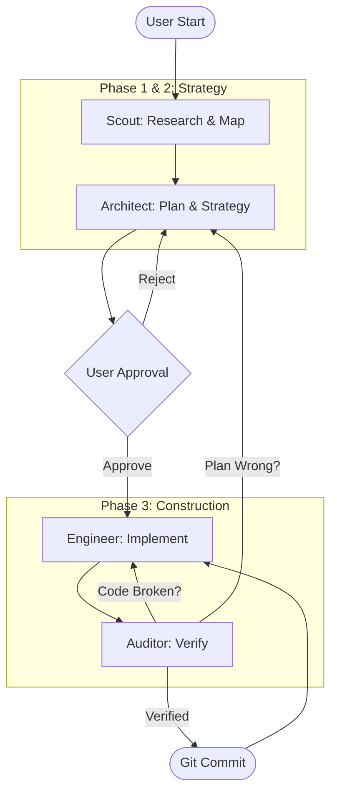

# GraphDB Skill Ecosystem

## 🤖 Multi-Agent Orchestration

This project uses a sophisticated multi-agent orchestration pattern to handle complex modernization tasks. The system is designed to be **self-correcting**, ensuring that plans match reality before code is committed.

### The Protocol Lifecycle

The system moves through distinct phases, enforced by the Supervisor. The **"Three-Way Decision Fork"** in the verification phase ensures plans remain realistic.



### The Supervisor (System Prompt)
The orchestration is managed by a **Supervisor protocol** defined in `.gemini/system.md`. 
*   **Rationale:** We moved from a standalone `supervisor` agent to a `system.md` override to ensure the primary agent (you) has the native authority to dispatch specialized sub-agents (Scout, Engineer, etc.) without intermediate layers of delegation that can obscure context or restrict tool access.
*   **Enabling:** To activate this protocol, ensure your environment is configured with `GEMINI_SYSTEM_MD=true`.

### Specialized Sub-Agents
Each agent has a dedicated role and system prompt located in `.gemini/agents/`.

*   **Architect**: The **Planner**. Manages the roadmap (`@plans/`) and creates detailed implementation plans. Called when plans are missing or need correction (reality check).
*   **Scout**: The **Researcher**. Uses the GraphDB to map dependencies, identify global state usage, and find architectural "seams".
*   **Engineer**: The **Builder**. Implements changes using strict Test-Driven Development (TDD). **Constraint:** Cannot perform git commits.
*   **Auditor**: The **Quality & Consistency Gatekeeper**. Verifies tests and ensures the active Plan matches the Codebase reality.
    *   *Code Failure:* Dispatches `engineer` to retry.
    *   *Plan Failure:* Dispatches `architect` to fix the plan.
    *   *Success:* Allows the Supervisor to proceed to Git Commit.
*   **MSBuild**: The **Specialist**. Handles running builds and tests, providing concise error reporting.

## 🚀 Getting Started

### Prerequisites

*   **Go 1.24+** -- required to build the `graphdb` binary.

### Building the Go Binary

The primary tool is the `graphdb` Go binary. Build it from the project root:

```bash
go build -o .gemini/skills/graphdb/scripts/graphdb cmd/graphdb/main.go
```

This produces `.gemini/skills/graphdb/scripts/graphdb`, which is where the Gemini CLI agent skill expects it.

## 🗄️ Neo4j Database Setup

This project uses a Neo4j database containerized with Podman/Docker. A helper script is provided to launch the container with the correct APOC plugins and configuration.

1.  **Launch Container:**
    ```bash
    bash .gemini/skills/neo4j-manager/scripts/start_neo4j_container.sh
    ```
    *   **User:** `neo4j`
    *   **Password:** `password`
    *   **UI:** [http://localhost:7474](http://localhost:7474)

## 🛠️ Build & Ingestion Workflow

To analyze a codebase, you must first ingest it into the Graph Database. Run these commands from the **project root**:

1.  **Extract Graph Data** (Parses source code, generates embeddings, outputs JSONL):
    ```bash
    .gemini/skills/graphdb/scripts/graphdb ingest -dir <target-dir> -nodes graph_data/nodes.jsonl -edges graph_data/edges.jsonl -project $GOOGLE_CLOUD_PROJECT
    ```
    Omit `-project` to use mock embeddings (faster, no GCP dependency).

2.  **Build RPG Features** (Groups functions into semantic features using LLM):
    ```bash
    .gemini/skills/graphdb/scripts/graphdb enrich-features -dir <target-dir> -input graph_data/nodes.jsonl -output graph_data/rpg.jsonl -project $GOOGLE_CLOUD_PROJECT
    ```
    Flags: `--cluster-mode=semantic` for embedding-based clustering, `--mock-embedding` for dry runs.

3.  **Import to Neo4j** (Loads JSONL into the database):
    ```bash
    .gemini/skills/graphdb/scripts/graphdb import -input graph_data/nodes.jsonl -clean
    .gemini/skills/graphdb/scripts/graphdb import -input graph_data/rpg.jsonl
    ```

## 🔍 Usage & Analysis

The project follows a **"Graph-First"** workflow powered by the **`graphdb` Go binary**. It provides a unified interface for structural (Neo4j), semantic (Vector Embeddings), and intent-based (RPG) analysis.

### Query Commands

All queries use the same pattern: `.gemini/skills/graphdb/scripts/graphdb query -type <type> [options]`

*   **Intent-Based Search (RPG):** Find where a concept lives in the codebase.
    ```bash
    .gemini/skills/graphdb/scripts/graphdb query -type search-features -target "authentication" -project $GOOGLE_CLOUD_PROJECT
    ```
*   **Explore Feature Hierarchy:** Navigate the RPG domain/feature tree.
    ```bash
    .gemini/skills/graphdb/scripts/graphdb query -type explore-domain -target "domain-rpg"
    ```
*   **Dependency Analysis:** Determine what a function depends on.
    ```bash
    .gemini/skills/graphdb/scripts/graphdb query -type neighbors -target "function_name"
    ```
*   **Impact Analysis:** Find upstream callers affected by a change.
    ```bash
    .gemini/skills/graphdb/scripts/graphdb query -type impact -target "function_name" -depth 3
    ```
*   **Hybrid Context:** Combine structural dependencies with semantic similarity.
    ```bash
    .gemini/skills/graphdb/scripts/graphdb query -type hybrid-context -target "function_name" -project $GOOGLE_CLOUD_PROJECT
    ```
*   **Other query types:** `search-similar`, `globals`, `seams`, `fetch-source`, `locate-usage`.

### Text Search (Fallback)
Use standard `search_file_content` (Ripgrep) **ONLY** when the `graphdb` skill cannot provide the necessary data (e.g., searching for non-code assets or literal TODOs).

## ⚡ Utilities (Neo4j Manager)

If you need to switch between different project databases (Neo4j Community limit):

*   **List Databases:**
    ```bash
    node .gemini/skills/neo4j-manager/scripts/list_databases.js
    ```
*   **Switch Database:**
    ```bash
    node .gemini/skills/neo4j-manager/scripts/switch_database.js <TargetDBName>
    ```

## 🕵️ Agent Execution Tracing

To understand the complex interactions between agents (e.g., CLI -> Supervisor -> Engineer), the project includes a configured execution tracer.

*   **Log File:** `.gemini/execution-trace.jsonl`
*   **Mechanism:** A hook script (`.gemini/hooks/agent-tracer.js`) intercepts `BeforeAgent`, `AfterAgent`, `BeforeTool`, and `AfterTool` events.
*   **Purpose:**
    *   Visualize the call stack of nested agents.
    *   Debug "Human in the Loop" interactions (e.g., does the stack unwind or pause?).
    *   Audit tool usage and arguments in real-time.

### 📊 Trace Viewer

A lightweight, single-file HTML viewer is included to visualize the trace logs.

1.  **Start Server:** (Optional but recommended for browser compatibility)
    ```bash
    # Option A: Node.js
    npx http-server .
    # Option B: Python
    python3 -m http.server 8080
    ```
2.  **Open:** Navigate to `http://localhost:8080/trace-viewer.html` (or open the file directly in a modern browser).
3.  **Load:** Drag & Drop `.gemini/execution-trace.jsonl` onto the page.
4.  **Analyze:** Filter by session or file to see the chronological lineage of agent operations.

To disable tracing, remove the `hooks` section from `.gemini/settings.json`.
