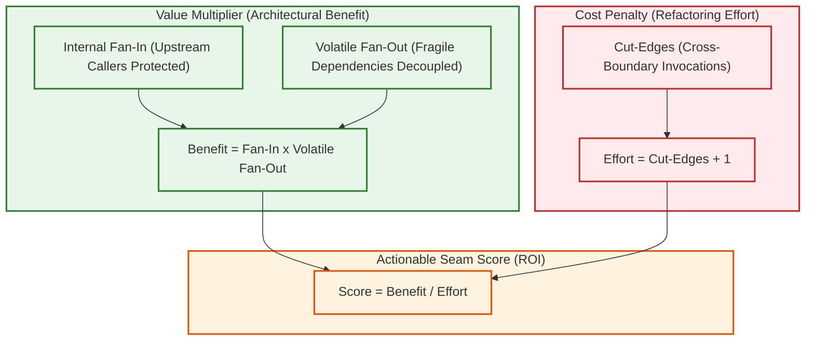

# Actionable Feathers Seam Ranking

## 1. Overview & Problem: The Legacy Alert Fatigue Paradox

Monolithic applications are inherently messy. When an algorithm detects structural communities, thousands of edges cross between them.[^seam-ranker] 

Reporting all cut-edges as candidate refactoring seams creates **Alert Fatigue**:
* An engineer receives a list of 850 proposed seams.
* Most proposed seams require decoupling 30+ interwoven function calls across multiple files.
* Developers dismiss the analysis as impractical academic theory and revert to manual trial-and-error.

---

## 2. The Feathers Seam Score Handshake

The GraphDB Skill eliminates alert fatigue by unifying **Topological Cut-Edge Analysis** with the **Feathers Modernization Suite** into a single Return-on-Investment (ROI) metric ([`internal/analysis/seam_ranker.go`](file:///home/jasondel/dev/graphdb-skill/internal/analysis/seam_ranker.go)):[^query-seams]

$$\text{ActionableSeamScore}(S) = \frac{\text{InternalFanIn}(S) \times \text{VolatileFanOut}(S)}{\text{CutEdges}(S) + 1}$$



---

## 3. Mathematical Deconstruction

### 3.1 The Value Numerator: $\text{InternalFanIn} \times \text{VolatileFanOut}$
* **Internal Fan-In:** Measures how many internal domain functions depend on this seam. Higher fan-in means mocking or abstracting this single point unlocks unit testing for a larger portion of the subsystem.
* **Volatile Fan-Out:** Measures how many database, network, or UI calls this seam encapsulates. Higher volatility means the seam protects domain logic from runtime instability.
* **The Multiplicative Effect:** Just as in Feathers' classic Pinch Point theorem, multiplying fan-in by volatile fan-out surfaces true architectural chokepoints rather than simple high-degree utilities.

### 3.2 The Effort Denominator: $\text{CutEdges} + 1$
* **Cut-Edges ($E_{\text{cut}}$):** The exact number of structural invocation edges that cross the boundary between the target community and adjacent subsystems.
* **The $+1$ Smoothing Constant:** Prevents division by zero when an isolated component has zero external cut-edges.
* **The Exponential Refactoring Penalty:** 
  * A seam with $1$ cut-edge has divisor $2$. Refactoring requires introducing a single interface method.
  * A seam with $24$ cut-edges has divisor $25$. Refactoring requires introducing a complex 24-method interface and coordinating call migrations across dozens of files.

---

## 4. Prioritization Matrix & Triage Rules

The engine categorizes discovered seams into actionable tiers:

| Tier | Cut-Edges | Score Profile | Prescribed Action |
| :--- | :--- | :--- | :--- |
| **Tier 1: Immediate Win** | $\le 4$ cut-edges | High ($> 50.0$) | **Extract Interface / Mock Immediately.** Maximum testing unlock with minimal refactoring effort. |
| **Tier 2: Coordinated Seam** | $5$ to $10$ cut-edges | Moderate ($15.0$ to $50.0$) | **Introduce Facade.** Group cross-boundary calls into a coarse-grained gateway before extracting. |
| **Tier 3: Diffuse Entanglement** | $> 10$ cut-edges | Low ($< 15.0$) | **Do Not Touch Directly.** Suppress alert. Diffuse coupling must first be pruned using Single Responsibility Principle (SRP) file splitting. |

---

## 5. Output Recipe Contract for Agents

When queried via `graphdb query -type dual-lens-seams`, the engine emits structured JSON recipes designed for autonomous agents:

```json
{
  "seam_id": "seam_orders_billing_01",
  "community_source": "community_orders",
  "community_target": "community_billing",
  "actionable_score": 78.5,
  "internal_fan_in": 32,
  "volatile_fan_out": 5,
  "cut_edges": 2,
  "entry_points": [
    "OrderService.AuthorizePayment()",
    "OrderService.CaptureFunds()"
  ],
  "prescription": "Extract IPaymentGateway interface with 2 methods. Inject into OrderService."
}
```

[^seam-ranker]: [`seam_ranker.go`](file:///home/jasondel/dev/graphdb-skill/internal/analysis/seam_ranker.go)
[^query-seams]: [`neo4j_semantic_seams.go`](file:///home/jasondel/dev/graphdb-skill/internal/query/neo4j_semantic_seams.go)
