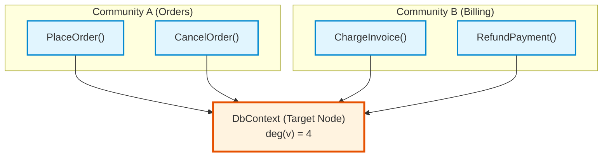

# Boundary Participation Ratio (BPR) & Shared Infrastructure

## 1. Overview & Architectural Problem

When modernizing a monolithic application into modular services, not all cross-boundary code represents architectural debt.[^bpr-impl] Legitimate shared infrastructure components exist by design:
* Database context singletons (`ApplicationDbContext`)
* Message brokers and event buses (`IEventBus`, `KafkaProducer`)
* Shared domain serializers (`ProtobufSerializer`, `JsonMapper`)
* Security and session context holders (`UserSessionContext`)

If a community detection algorithm is forced to assign such a component exclusively to **Community A**, every invocation coming from **Community B** will be incorrectly flagged as a "leaky boundary" violation.[^bpr-types] This false-positive noise destroys developer trust.

---

## 2. Mathematical Formulation of BPR

The **Boundary Participation Ratio (BPR)** measures the proportion of a node's total connectivity dedicated to each individual community ([`internal/analysis/leiden/bpr.go`](file:///home/jasondel/dev/graphdb-skill/internal/analysis/leiden/bpr.go)):

$$\text{BPR}(v, c_k) = \frac{|\{u \in c_k \mid (v, u) \in E\}|}{\text{deg}(v)}$$

Where:
* $v$ is the target node under evaluation.
* $c_k$ is a specific structural community discovered by the CPM Leiden engine.
* $|\{u \in c_k \mid (v, u) \in E\}|$ is the count of edges between node $v$ and members of community $c_k$.
* $\text{deg}(v)$ is the total degree of node $v$ across the entire graph.

In the diagram above:
* $\text{deg}(\text{DbContext}) = 4$
* Edges to Community A = 2 $\implies \text{BPR}(\text{DbContext}, \text{CommA}) = \frac{2}{4} = 0.50$
* Edges to Community B = 2 $\implies \text{BPR}(\text{DbContext}, \text{CommB}) = \frac{2}{4} = 0.50$

---

## 3. Multi-Community Classification Rules

The engine evaluates BPR values for every node sitting on a partition boundary:

| Condition | Classification | Neo4j Representation |
| :--- | :--- | :--- |
| $\text{BPR}(v, c_k) \ge 0.25$ for $\ge 2$ distinct communities | **Shared Boundary Component** | `:SharedBoundary` label with `[:BRIDGES]` edges to each participating community. |
| Uniformly low BPR across $\ge 5$ communities ($\text{BPR} < 0.10$) | **Cross-Cutting Universal Hub** | `:CrossCuttingHub` label with `[:INFRASTRUCTURE_OF]` edges. |
| $\text{BPR}(v, c_{\text{primary}}) \ge 0.75$ with minor leaks ($\text{BPR} \le 0.10$) | **Standard Domain Node with Leak** | Remains assigned to primary community; minor edges flagged as leaky boundary alerts. |

---

## 4. Modernization & Swarm Refactoring Impact

Classifying nodes via BPR provides precise guidance for AI refactoring agents:

1. **Suppression of False Alarms:** Calls into `:SharedBoundary` nodes are recognized as intentional shared contracts and excluded from divergence leak alerts.
2. **Interface Extraction Recipes:** When an agent prepares to extract Community A into an independent microservice, any `:SharedBoundary` node it touches becomes a candidate for:
   * Interface abstraction (Dependency Inversion).
   * Shared NuGet / NPM / Go module extraction.
   * Anti-Corruption Layer (ACL) wrapping.
3. **Conflict-Free Swarm Partitioning:** When multiple AI agents work concurrently on different communities, `:SharedBoundary` nodes are locked as shared contracts to prevent conflicting modifications.

[^bpr-impl]: [`bpr.go`](file:///home/jasondel/dev/graphdb-skill/internal/analysis/leiden/bpr.go)
[^bpr-types]: [`types.go`](file:///home/jasondel/dev/graphdb-skill/internal/analysis/leiden/types.go)
