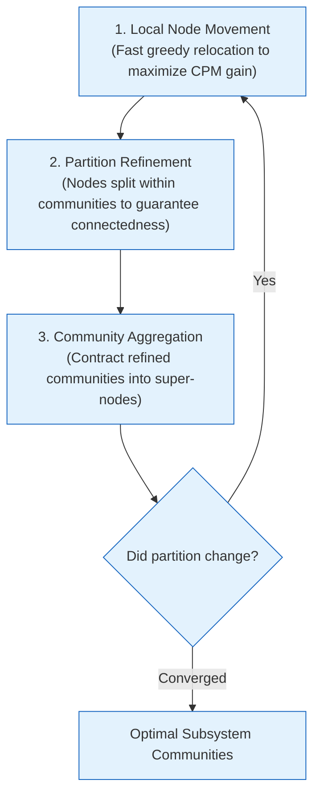

# Constant Potts Model (CPM) & The Leiden Engine

## 1. Overview & Mathematical Motivation

Community detection in software graphs attempts to partition code into cohesive subsystems with dense internal calls and sparse external calls.[^leiden-core] 

Most graph literature relies on **Newman-Girvan Modularity Optimization**:
$$\mathcal{Q} = \frac{1}{2m} \sum_{i,j} \left( A_{ij} - \frac{k_i k_j}{2m} \right) \delta(c_i, c_j)$$

### The Fatal Flaw: The Resolution Limit
Fortunato and Barthélemy (2007) proved that modularity suffers from an inherent **Resolution Limit**. Any community whose total internal edge count is smaller than $\sqrt{2m}$ (where $m$ is total edges in the graph) will fail to be resolved and will instead be merged into adjacent clusters.

In a codebase with 100,000 call edges:
$$\sqrt{2 \times 100,000} \approx 447 \text{ edges}$$
Modularity optimization will systematically obliterate tight, cohesive 20–50 function microservice candidates, merging them into massive monolithic clusters.

---

## 2. The Constant Potts Model (CPM) Quality Function

To eliminate the resolution limit, the GraphDB Skill implements Traag et al.'s **Constant Potts Model (CPM)** ([`internal/analysis/leiden/cpm.go`](file:///home/jasondel/dev/graphdb-skill/internal/analysis/leiden/cpm.go)):[^cpm-impl]

$$\mathcal{H}_{\text{CPM}} = -\sum_c \left[ e_c - \gamma \binom{n_c}{2} \right]$$

Where:
* $e_c = \sum_{u,v \in c} W_{\text{eff}}(u, v)$ is the total internal edge weight of community $c$.
* $n_c$ is the number of nodes in community $c$.
* $\binom{n_c}{2} = \frac{n_c(n_c - 1)}{2}$ is the maximum possible number of edges in a clique of size $n_c$.
* $\gamma > 0$ is the **resolution parameter** representing the edge density threshold.

### Why CPM is Resolution-Free
Unlike modularity, where the null model scales with total graph size $2m$, the penalty term in CPM ($\gamma \binom{n_c}{2}$) is **strictly local** to each community. A community will be separated from another if and only if the edge density between them is less than $\gamma$, regardless of how large the surrounding graph grows.

---

## 3. The Leiden Algorithm: Three Guarantees Over Louvain

Louvain community detection frequently yields disconnected or poorly connected communities. The **Leiden algorithm** guarantees well-connected communities through a 3-phase iterative cycle:



1. **Local Node Movement:** Nodes are greedily shifted to neighboring communities that maximize the change in $\mathcal{H}_{\text{CPM}}$.
2. **Refinement Phase:** Unlike Louvain, Leiden examines each community locally, splitting it if any sub-cluster is not well-connected internally. This guarantees that communities never contain disconnected components.
3. **Aggregation:** Communities are compressed into aggregate super-nodes for multi-scale hierarchy.

---

## 4. Dynamic $\gamma$ Bisection Search

Selecting $\gamma$ manually is difficult because edge density varies widely across programming languages and architectures. The engine implements an automated **Bisection Search** ([`internal/analysis/leiden/adaptive.go`](file:///home/jasondel/dev/graphdb-skill/internal/analysis/leiden/adaptive.go)):[^adaptive-impl]

```mermaid
flowchart TD
    Init["Search Interval: gamma in [0.001, 0.5]\nTarget Size: [30, 250] functions / community"] --> Mid["gamma_mid = (gamma_low + gamma_high) / 2"]
    Mid --> Run["Execute Leiden Trial at gamma_mid"]
    Run --> Check{"Median Community Size"}
    Check -->|Size > 250 (Too Large)| Low["gamma_low = gamma_mid (Increase resolution)"]
    Check -->|Size < 30 (Too Small)| High["gamma_high = gamma_mid (Decrease resolution)"]
    Check -->|30 <= Size <= 250| Conv["Optimal Gamma Found!"]

    Low --> Mid
    High --> Mid

    classDef proc fill:#e3f2fd,stroke:#1565c0,stroke-width:1px;
    class Init,Mid,Run,Check,Low,High,Conv proc;
```

---

## 5. Recursive Hierarchical Splitting

In enterprise monoliths, certain domains (e.g., core order processing) naturally comprise over 1,000 tightly coupled functions that cannot be resolved in a global pass. 
* For any community where $n_c > 300$, the engine extracts the subgraph of that community and runs a recursive sub-partition pass using:
  $$\gamma_{\text{local}} = 1.5 \cdot \gamma_{\text{parent}}$$
* This guarantees deep, hierarchical decomposition into microservice-sized modules ($N \le 250$) while preserving high-level parent community containment.

[^cpm-impl]: [`cpm.go`](file:///home/jasondel/dev/graphdb-skill/internal/analysis/leiden/cpm.go)
[^adaptive-impl]: [`adaptive.go`](file:///home/jasondel/dev/graphdb-skill/internal/analysis/leiden/adaptive.go)
[^leiden-core]: [`leiden.go`](file:///home/jasondel/dev/graphdb-skill/internal/analysis/leiden/leiden.go)
