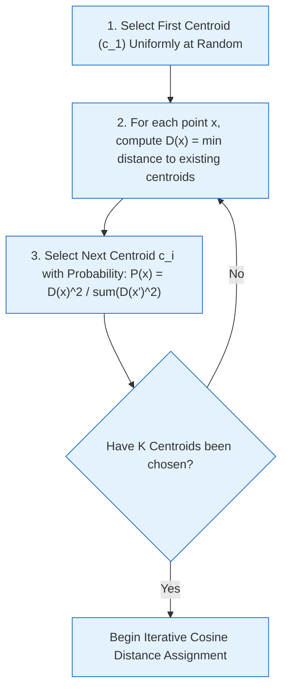

# K-Means++ Clustering on Dense Vector Space

## 1. Overview & Theoretical Purpose

In the Repository Planning Graph (RPG), business domains and features are not defined by static package names or directory boundaries.[^cluster-impl] Instead, they are discovered naturally by clustering functions within a 768-dimensional latent semantic space produced by `gemini-embedding-001`.[^embedder-impl]

The clustering engine groups functions based on conceptual similarity (e.g., all functions that manipulate payment authorizations or validate session tokens) regardless of which physical directory or source file they reside in.

---

## 2. Dynamic Domain Sizing ($K$)

Unlike traditional clustering where $K$ is arbitrary or hardcoded, the GraphDB Skill dynamically dimensions the number of target domains $K$ based on repository size:

$$K = \text{clamp}\left(\left\lfloor \sqrt{\frac{\text{fileCount}}{5}} \right\rfloor, 5, 50\right)$$

* **Lower Bound ($K \ge 5$):** Prevents small codebases from collapsing into a trivial single domain.
* **Upper Bound ($K \le 50$):** Prevents multi-million-line monoliths from fragmenting into an unmanageable cognitive hierarchy.
* **Square Root Scaling:** Balances domain granularity against human cognitive capacity ($7 \pm 2$ concepts per system).

---

## 3. K-Means++ Centroid Initialization

Standard K-Means with random centroid selection is notoriously vulnerable to local minima, often clustering near-identical functions into separate centroids while merging distinct business concepts.

The engine implements **Arthur & Vassilvitskii's K-Means++** initialization:

### The $D(x)^2$ Probability Distribution
$$P(x) = \frac{D(x)^2}{\sum_{x' \in X} D(x')^2}$$
* Points that are already close to an existing centroid have $D(x) \approx 0$ and have virtually zero probability of becoming a center.
* Points situated far out in unexplored semantic territory (e.g., database storage logic vs. UI rendering) have high $D(x)$ and are chosen with near certainty.
* This guarantees initial centroids span the full breadth of the application's architectural domains.

---

## 4. Distance Metric & Convergence

### 4.1 Normalized Cosine Distance
Because embeddings represent semantic direction rather than magnitude, distance is computed via Angular/Cosine Distance:
$$D_{\text{cosine}}(\mathbf{u}, \mathbf{v}) = 1.0 - \frac{\mathbf{u} \cdot \mathbf{v}}{\|\mathbf{u}\| \|\mathbf{v}\|}$$
For unit-normalized vectors ($\|\mathbf{u}\| = 1$), this reduces to a fast dot product:
$$D_{\text{cosine}}(\mathbf{u}, \mathbf{v}) = 1.0 - \sum_{i=1}^{768} u_i v_i$$

### 4.2 Convergence Thresholds
The algorithm iterates until:
1. Centroid movement between iterations falls below $\epsilon < 10^{-4}$, OR
2. Maximum iteration count ($N_{\max} = 50$) is reached.

---

## 5. Lowest Common Ancestor (LCA) Grounding

Pure vector clustering can occasionally group syntactically identical utilities scattered across the codebase. To preserve physical cohesion:
1. For every discovered semantic cluster, the engine evaluates the physical file paths of its member functions.
2. It computes the **Lowest Common Ancestor (LCA)** directory path across those files.
3. If an LCA directory exists with high purity ($\ge 70\%$ of member functions share that root), the domain is grounded in that filesystem context, ensuring generated summaries reflect real project structure.

[^cluster-impl]: [`cluster_semantic.go`](file:///home/jasondel/dev/graphdb-skill/internal/rpg/cluster_semantic.go)
[^embedder-impl]: [`embedder.go`](file:///home/jasondel/dev/graphdb-skill/internal/rpg/embedder.go)
