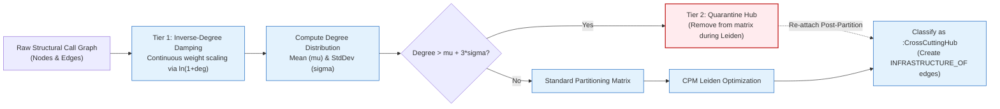

# Two-Tier Hub Suppression & Hairball Collapse Prevention

## 1. The Hairball Collapse Phenomenon

In real-world legacy enterprise monoliths, certain utility functions and global state variables are ubiquitous:[^quarantine-impl]
* Logging functions (e.g., `Log::Debug`, `Console.WriteLine`)
* String/Date formatting helpers (`StringUtils::Trim`, `DateTimeUtils::Parse`)
* Configuration singletons (`AppConfig::GetInstance()`, `Environment.GetEnvironmentVariable`)
* Global database connection singletons (`DB::GetConnection`)

When standard community detection algorithms analyze an unweighted or raw call graph, these high-degree hubs act as **gravitational black holes**.[^damping-impl] Because nearly every subsystem calls the logger or config helper, the algorithm calculates that merging everything into a single massive cluster maximizes internal edge density.

### The Collapse Outcome
* **Cluster 01:** Contains 85% to 95% of the entire codebase.
* **Clusters 02–50:** Tiny 1-node or 2-node orphan clusters.
* **Modernization Value:** Exactly zero.

---

## 2. The Two-Tier Suppression Architecture

The GraphDB Skill introduces a dual-defense mechanism combining continuous logarithmic damping with discrete statistical quarantine:



---

## 3. Tier 1: Logarithmic Inverse-Degree Edge Damping

Inspired by Inverse Document Frequency (IDF) in information retrieval, Tier 1 scales edge weights inversely with the degree of the connected endpoints ([`internal/analysis/leiden/damping.go`](file:///home/jasondel/dev/graphdb-skill/internal/analysis/leiden/damping.go)):

$$W_{\text{eff}}(u, v) = W_{\text{base}}(u, v) \cdot \frac{1}{\ln(1 + \text{deg}(u)) \cdot \ln(1 + \text{deg}(v))}$$

### Base Edge Weights ($W_{\text{base}}$)
The engine assigns domain-aware base weights to different relationship types:
* `USES_GLOBAL`: $2.0$ (Strong coupling through shared mutable state)
* `INHERITS`: $1.5$ (Tight object-oriented coupling)
* `CALLS`: $1.0$ (Standard direct invocation)
* `CO_CHANGED`: $0.8$ (Temporal co-occurrence coupling)

### Numerical Impact of Damping
Consider two edges in a legacy C++ codebase:
1. **Domain Edge:** Function $A$ ($\text{deg} = 4$) calls Function $B$ ($\text{deg} = 6$):
   $$\text{Damping} = \frac{1}{\ln(5) \cdot \ln(7)} \approx \frac{1}{1.609 \cdot 1.945} \approx 0.319$$
2. **Logger Edge:** Function $A$ ($\text{deg} = 4$) calls `Logger::Log` ($\text{deg} = 5,000$):
   $$\text{Damping} = \frac{1}{\ln(5) \cdot \ln(5001)} \approx \frac{1}{1.609 \cdot 8.517} \approx 0.073$$

The edge into the logger is penalized by over **$4.3\times$** compared to the domain edge. This dampening breaks the artificial gravitational pull of pervasive utility functions.

---

## 4. Tier 2: Statistical Degree Quarantine

While logarithmic damping dramatically reduces hub pull, extreme hubs ($\text{deg} > 2,000$) can still distort community boundaries. Tier 2 applies a strict statistical quarantine filter ([`internal/analysis/leiden/quarantine.go`](file:///home/jasondel/dev/graphdb-skill/internal/analysis/leiden/quarantine.go)):

1. Computes the mean degree $\mu$ and standard deviation $\sigma$ across all nodes in the active graph.
2. Identifies the quarantine threshold:
   $$T_{\text{quarantine}} = \mu + 3\sigma$$
3. Any node where $\text{deg}(v) > T_{\text{quarantine}}$ (typically the top 0.5%–1% extreme hubs) is temporarily detached from the adjacency matrix.
4. The CPM Leiden algorithm runs to completion on the clean, unencumbered domain graph.

---

## 5. Post-Partition Re-Attachment

Quarantined hubs are not discarded; they represent vital enterprise infrastructure. After community optimization completes:
1. Quarantined nodes are labeled `:CrossCuttingHub` in Neo4j.
2. The engine evaluates which communities invoke the hub.
3. For every community $C$ where internal members call hub $H$, an explicit relationship is merged:
   ```cypher
   MERGE (h:CrossCuttingHub)-[:INFRASTRUCTURE_OF]->(c:StructuralCommunity)
   ```
4. This keeps community boundaries clean and cohesive while maintaining full visibility into shared cross-cutting dependencies for AI refactoring agents.

[^damping-impl]: [`damping.go`](file:///home/jasondel/dev/graphdb-skill/internal/analysis/leiden/damping.go)
[^quarantine-impl]: [`quarantine.go`](file:///home/jasondel/dev/graphdb-skill/internal/analysis/leiden/quarantine.go)
