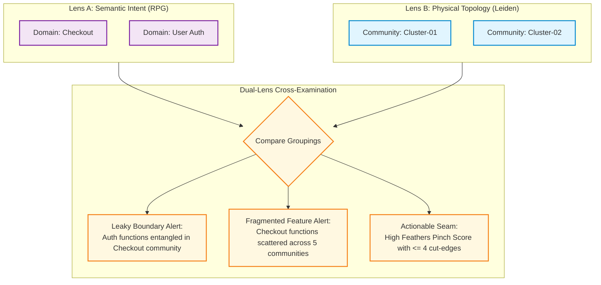
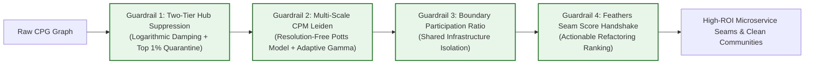

# Dual-Lens Topological Partitioning & The Leiden Engine

## 1. Executive Summary & Purpose

Modernizing monolithic enterprise applications requires understanding two orthogonal realities:
1. **Lens A: Business Intent (RPG Layer):** What the code is *intended* to do (semantic domains and features discovered via vector embeddings).[^divergence-analyzer]
2. **Lens B: Physical Wiring (Leiden Topology):** How the code is *actually connected* (structural call paths, variable mutation, and class inheritance).[^leiden-engine]

When these two lenses disagree, they pinpoint the exact location of architectural debt. The **Dual-Lens Leiden Engine** provides a zero-token, high-performance Go implementation of the **Constant Potts Model (CPM) Leiden algorithm** tailored specifically for messy legacy codebases.

---

## 2. Why Vanilla Leiden Fails on Legacy Monoliths

Standard graph community detection algorithms (such as Newman-Girvan Modularity Louvain or basic Leiden) produce catastrophic failures when run directly on 20-year-old enterprise monoliths:

1. **The Hairball Collapse Problem:** Legacy codebases contain pervasive utility hubs, logging frameworks, string helpers, and global state singletons. In a standard graph, these high-degree nodes act as "gravitational black holes", dragging 80% to 90% of the entire application into a single undifferentiated mega-cluster.
2. **The Modularity Resolution Limit:** Modularity optimization has a proven theoretical resolution limit proportional to $\sqrt{2m}$ (where $m$ is the total edge count). In large codebases, modularity is mathematically incapable of resolving tight 20–50 function microservice candidates, merging them into massive clusters.
3. **Legacy Alert Fatigue:** In legacy code, 90% of boundaries leak. Generating naive alerts for every divergence floods engineers with 4,000+ warnings, rendering the tool useless.

---

## 3. The Four Architectural Guardrails

To overcome these structural failure modes, the GraphDB Skill implements four strict architectural guardrails in pure Go:

### Guardrail 1: Two-Tier Hub Suppression
* **Tier 1: Inverse-Degree Logarithmic Edge Damping:** Call edges connecting to high-degree hubs are dampened dynamically using Inverse Document Frequency (IDF) principles ([`internal/analysis/leiden/damping.go`](file:///home/jasondel/dev/graphdb-skill/internal/analysis/leiden/damping.go)):[^hub-damping]
  $$W_{\text{eff}}(u, v) = W_{\text{base}}(u, v) \cdot \frac{1}{\ln(1 + \text{deg}(u)) \cdot \ln(1 + \text{deg}(v))}$$
* **Tier 2: Top 1% Degree Quarantine:** Nodes exceeding three standard deviations above the mean degree ($\text{deg}(v) > \mu + 3\sigma$) are temporarily removed from the adjacency matrix during community optimization. After partitioning, they are re-attached to the graph as `(:CrossCuttingHub)` nodes with `[:INFRASTRUCTURE_OF]` edges.

### Guardrail 2: Multi-Scale Constant Potts Model (CPM)
* **Resolution-Free Formulation:** Rather than Newman-Girvan modularity, the engine optimizes the Constant Potts Model Hamiltonian ([`internal/analysis/leiden/cpm.go`](file:///home/jasondel/dev/graphdb-skill/internal/analysis/leiden/cpm.go)):
  $$\mathcal{H}_{\text{CPM}} = -\sum_c \left[ e_c - \gamma \binom{n_c}{2} \right]$$
  where $e_c$ is total internal edge weight, $n_c$ is node count, and $\gamma$ represents edge density resolution.
* **Dynamic $\gamma$ Bisection Search:** The engine conducts an automated bisection search for $\gamma \in [0.001, 0.5]$ to target optimal microservice candidates ($30 \le \text{size} \le 250$).
* **Recursive Hierarchical Splitting:** Communities exceeding 300 nodes are recursively split using $\gamma_{\text{local}} = 1.5 \cdot \gamma_{\text{parent}}$.
* **Deterministic Seeds:** Supports `-seed <int>` to guarantee 100% reproducible community partitions across CI runs.

### Guardrail 3: Boundary Participation Ratio (BPR)
* **Distinguishing Shared Infrastructure from Domain Code:** Many components (e.g., `DbContext`, `EventBus`, `Serializer`) are genuinely shared across multiple subsystems ([`internal/analysis/leiden/bpr.go`](file:///home/jasondel/dev/graphdb-skill/internal/analysis/leiden/bpr.go)):[^bpr-classifier]
  $$\text{BPR}(v, c_k) = \frac{|\{u \in c_k \mid (v, u) \in E\}|}{\text{deg}(v)}$$
* If a node exhibits $\text{BPR} \ge 0.25$ across two or more distinct communities, it is classified as `(:SharedBoundary)` and linked via `[:BRIDGES]` edges rather than being forced into a single community.

### Guardrail 4: Feathers Seam Score Handshake
* **Eliminating Alert Fatigue:** Rather than reporting raw community cut-edges, the engine handshakes with the Feathers Modernization Suite ([`internal/analysis/seam_ranker.go`](file:///home/jasondel/dev/graphdb-skill/internal/analysis/seam_ranker.go)):
  $$\text{ActionableSeamScore} = \frac{\text{Internal Fan-In} \times \text{Volatile Fan-Out}}{\text{Cut-Edges} + 1}$$
* This ranks candidate seams by **Return on Investment (ROI)**: high architectural isolation impact combined with minimal interface extraction overhead ($\le 4$ cut-edges).

---

## 4. Architectural Divergence Metrics

The Dual-Lens engine measures misalignment between physical structure and business intent:

| Divergence Pattern | Root Cause in Legacy Code | Modernization Prescription |
| :--- | :--- | :--- |
| **Leaky Domain Boundary** | Code from Domain A (e.g., Billing) and Domain B (e.g., Inventory) are tightly coupled in the same Leiden community. | Introduce an interface seam or event-driven boundary at the cut-edges. |
| **Fragmented Feature** | A single logical Feature is physically scattered across $\ge 4$ isolated Leiden communities. | Colocate logic into a cohesive service module using Strangler Fig pattern. |
| **Pervasive Hub Entanglement** | A core domain class has turned into an omniscient God object with high degree across all clusters. | Decompose the God object using the BPR shared infrastructure recipe. |

---

## 5. Offline and Air-Gapped Operation

For enterprise environments with strict air-gapped security policies or zero cloud token allowances:
* The Leiden engine runs **100% locally and offline** using compiled Go.
* Running `graphdb enrich-topology` requires **zero API calls, zero LLMs, and zero cloud credentials**.
* Provides a baseline structural decomposition in seconds, allowing immediate architectural reasoning before any semantic enrichment is applied.

[^divergence-analyzer]: [`divergence.go`](file:///home/jasondel/dev/graphdb-skill/internal/analysis/divergence.go)
[^leiden-engine]: [`engine.go`](file:///home/jasondel/dev/graphdb-skill/internal/analysis/leiden/engine.go)
[^hub-damping]: [`damping.go`](file:///home/jasondel/dev/graphdb-skill/internal/analysis/leiden/damping.go)
[^bpr-classifier]: [`bpr.go`](file:///home/jasondel/dev/graphdb-skill/internal/analysis/leiden/bpr.go)
