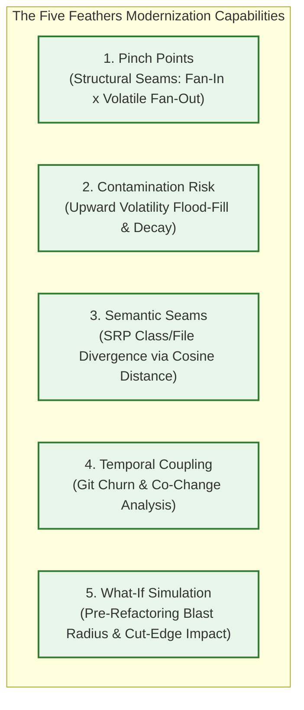
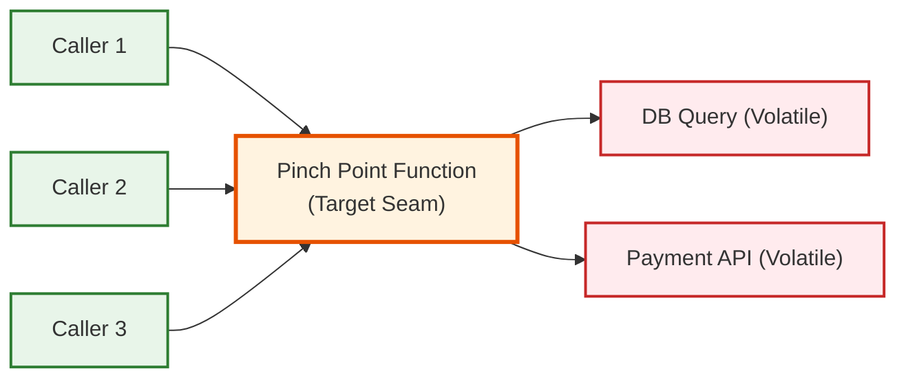

# The Feathers Modernization & Risk Suite

## 1. Overview & Theoretical Roots

Michael Feathers famously defined legacy code as *"code without tests"*. When refactoring monolithic systems, attempting to test everything simultaneously leads to analysis paralysis. Developers must identify **Seams** — places where you can alter behavior without editing source code directly, typically by introducing an interface or mock.[^neo4j-contamination]

The **Feathers Modernization Suite** converts Feathers' qualitative refactoring techniques into deterministic, graph-theoretic algorithms executed directly inside Neo4j.[^neo4j-whatif]

---

## 2. The Five Modernization Engines

---

## 3. Engine 1: Pinch Points (Structural Seams)

### Purpose
A **Pinch Point** is an architectural chokepoint sitting directly between stable, internal business logic and volatile external dependencies (databases, payment gateways, UI handlers, third-party APIs).[^neo4j-contamination]

Introducing an interface seam at a Pinch Point yields the highest possible refactoring ROI: mocking a single function immediately unlocks unit testability for dozens of upstream callers.

### Mathematical Formulation

$$\text{PinchScore}(f) = \text{InternalFanIn}(f) \times \text{VolatileFanOut}(f)$$
* **$\text{InternalFanIn}(f)$:** The count of non-volatile, stable callers invoking function $f$.
* **$\text{VolatileFanOut}(f)$:** The count of volatile external dependencies directly invoked by function $f$.

Functions with high pinch scores represent the highest-priority locations for introducing dependency injection boundaries.

---

## 4. Engine 2: Contamination & Risk Propagation

### 4.1 Upward Flood-Fill
If function $B$ interacts with an external database or network socket (`is_volatile: true`), any function $A$ calling $B$ is inherently contaminated by that volatility. The engine executes a deterministic upward flood-fill along incoming `CALLS` edges in Neo4j.

### 4.2 Distance-Decayed Volatility Scoring
Volatility risk decays with topological distance from the volatile leaf:
$$\text{VolatilityScore}(f) = \frac{1.0}{\text{distance}_{\text{min}}(f, \text{Volatile}) + 1}$$
* Distance = 0: Directly volatile ($1.0$)
* Distance = 1: Direct caller of volatile ($0.5$)
* Distance = 2: Two hops away ($0.33$)

### 4.3 Composite Risk Score
The engine normalizes a composite risk metric combining four architectural vectors:
$$\text{RawRisk}(f) = (\text{FanIn} \cdot 0.4) + (\text{FanOut} \cdot 0.1) + (\text{VolatilityScore} \cdot 3.0) + (\text{Churn} \cdot 0.4)$$
$$\text{RiskScore}(f) = \frac{\text{RawRisk}(f)}{\max(\text{RawRisk})}$$
Functions with $\text{RiskScore} \approx 1.0$ represent the most dangerous, unstable hubs in the codebase.

---

## 5. Engine 3: Semantic Seams (SRP Divergence)

### Purpose
Identifies Single Responsibility Principle (SRP) violations within a single `File` or `Class` container by comparing the semantic cosine similarity of its constituent functions ([`internal/query/neo4j_semantic_seams.go`](file:///home/jasondel/dev/graphdb-skill/internal/query/neo4j_semantic_seams.go)).[^neo4j-semantic-seams]

### Mechanism
1. For every `Class` or `File`, pairs of member functions $(f_i, f_j)$ are extracted.
2. The engine computes Cosine Similarity between their 768d vector embeddings:
   $$\text{Sim}(f_i, f_j) = \frac{\mathbf{v}_i \cdot \mathbf{v}_j}{\|\mathbf{v}_i\| \|\mathbf{v}_j\|}$$
3. Pairs where $\text{Sim} < 0.5$ (CLI default) or $< 0.6$ (UI default) are flagged.

A file containing functions with near-zero semantic similarity indicates that unrelated business responsibilities were artificially bundled together, providing a clear recipe for file splitting.

---

## 6. Engine 4: Git Churn & Co-Change Coupling

Static code structure does not reveal temporal coupling:
* **Churn Frequency:** Files modified frequently in Git commits indicate instability and high bug density.
* **Co-Change Coupling:** Pairs of files that consistently change together in the same commits (even with zero static AST references) expose hidden side-channel coupling, such as shared database schemas, message queue formats, or copy-pasted logic.

---

## 7. Engine 5: What-If Blast Radius Simulation

Before modifying a legacy class or function, engineers need to understand the structural impact ([`internal/query/neo4j_whatif.go`](file:///home/jasondel/dev/graphdb-skill/internal/query/neo4j_whatif.go)):[^neo4j-whatif]
* **Upward Caller Impact:** Returns all direct and transitive callers that will be broken if the target function's signature or contract changes.
* **Severed Downstream Dependencies:** Identifies which subtrees become unreachable.
* **Contamination Relief:** Calculates how much global graph contamination decreases if the target function is decoupled or mocked.

[^neo4j-contamination]: [`neo4j_contamination.go`](file:///home/jasondel/dev/graphdb-skill/internal/query/neo4j_contamination.go)
[^neo4j-semantic-seams]: [`neo4j_semantic_seams.go`](file:///home/jasondel/dev/graphdb-skill/internal/query/neo4j_semantic_seams.go)
[^neo4j-whatif]: [`neo4j_whatif.go`](file:///home/jasondel/dev/graphdb-skill/internal/query/neo4j_whatif.go)
