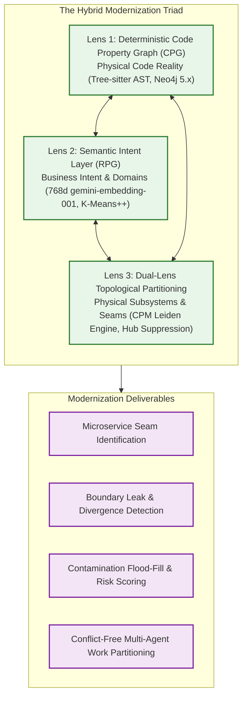
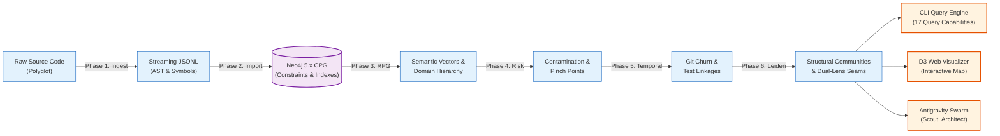

# Hybrid Triad Architectural Overview

## 1. Executive Summary & Purpose

The **GraphDB Skill** is an enterprise-grade legacy modernization and architectural reasoning subsystem designed for the **Gemini CLI** and **Antigravity Multi-Agent Swarms**.[^gemini-ecosystem] 

Navigating and modernizing multi-million-line enterprise monoliths (written in C++, C#, Java, TypeScript, Python, ASP Classic, VB.NET, and SQL) presents a fundamental paradox for AI coding agents:
1. **Raw Source Text & Regex Grepping** fail because legacy codebases are rife with implicit dependencies, circular invocations, global state mutation, and non-linear blast radiuses.
2. **Pure Vector Embeddings** fail because embedding raw code chunks or function signatures groups code by stylistic or syntactical similarity rather than structural call paths or business intent.
3. **Pure Graph ASTs (Code Property Graphs)** fail because large legacy systems degenerate into monolithic "hairballs" where utility classes and global singletons connect everything to everything, hiding true architectural boundaries.

To solve this, the GraphDB Skill introduces a **Hybrid Triad Architecture** uniting three complementary representations of software into a single unified knowledge graph:[^graphdb-core]

---

## 2. The Three Architectural Layers

### Layer 1: The Physical Layer (Code Property Graph - CPG)
* **What it represents:** The physical, syntactic reality of source code on disk.
* **Extraction:** Generated deterministically and offline by high-performance CGO Tree-sitter parsers ([`internal/ingest/walker.go`](file:///home/jasondel/dev/graphdb-skill/internal/ingest/walker.go)).
* **Key Entities:** `File`, `Class`, `Interface`, `Function`, `Constructor`, `Field`, `Global`, `Table`.
* **Key Relationships:** `CALLS`, `USES`, `USES_GLOBAL`, `HAS_METHOD`, `DEFINES`, `EXTENDS`, `IMPLEMENTS`, `DEPENDS_ON`, `DEFINED_IN`.
* **Deep Dive:** See [Physical Code Property Graph](/architecture/physical-cpg.md).

### Layer 2: The Intent Layer (Repository Planning Graph - RPG)
* **What it represents:** The architectural "why" and business domain intent.
* **Extraction:** LLMs read sliced function implementations to extract normalized, domain-first "verb-object" descriptors (e.g., `process-credit-card-payment`, `validate-jwt-token`) and volatility classifications ([`internal/rpg/extractor.go`](file:///home/jasondel/dev/graphdb-skill/internal/rpg/extractor.go)).
* **Clustering & Discovery:** Descriptors are vectorized into 768-dimensional dense embeddings (`gemini-embedding-001`), clustered via **K-Means++** with file-grounded lowest-common-ancestor (LCA) seeding, and named by generative models into hierarchical `Domain` and `Feature` nodes.
* **Key Relationships:** `(:Domain)-[:PARENT_OF]->(:Feature)` and `(:Function)-[:IMPLEMENTS]->(:Feature)`.
* **Deep Dive:** See [Semantic Intent Layer (RPG)](/architecture/intent-layer-rpg.md).

### Layer 3: The Topological Layer (Dual-Lens Leiden Partitioning)
* **What it represents:** How code is *physically clustered* based on dense call and state graph topology, completely independent of human labeling or vector similarity.
* **Algorithm:** A pure Go implementation of the **Constant Potts Model (CPM) Leiden algorithm** with Two-Tier Hub Suppression and dynamic $\gamma$ bisection search ([`internal/analysis/leiden/`](file:///home/jasondel/dev/graphdb-skill/internal/analysis/leiden/)).
* **Dual-Lens Divergence:** Cross-examining Lens 2 (Business Intent) against Lens 3 (Physical Leiden Communities) automatically flags:
  1. **Leaky Domain Boundaries:** Functions belonging to separate business domains entangled in the same tight physical cluster.
  2. **Fragmented Features:** Functions implementing the same business feature scattered across disconnected physical communities.
* **Key Relationships:** `(:Function)-[:IN_COMMUNITY]->(:StructuralCommunity)`, `(:StructuralCommunity)-[:BRIDGES]->(:StructuralCommunity)`, and `(:Function)-[:INFRASTRUCTURE_OF]->(:StructuralCommunity)`.
* **Deep Dive:** See [Dual-Lens Topology](/architecture/dual-lens-topology.md).

---

## 3. High-Level Data Flow

The following sequence illustrates how raw source code transforms through the 6-phase ingestion and modernization pipeline into queryable intelligence for AI agents:

---

## 4. Key Differentiators

| Capability | Standard Vector RAG | Static Linters / Sonar | GraphDB Skill Hybrid |
| :--- | :--- | :--- | :--- |
| **Dependency Depth** | None (lexical similarity only) | 1-hop static calls | Multi-hop transitive blast radius + global state tracking |
| **Architectural Abstraction** | Flat chunks | File/Package boundaries | Multi-level Domain & Feature intent hierarchy |
| **Microservice Seams** | Unaware | Module metrics (coupling/cohesion) | Dual-Lens Seam Ranker (Feathers pinch $\times$ Leiden cut-edges) |
| **Shared State & Globals** | Blind | Local variable scope | Graph-wide `USES_GLOBAL` propagation and quarantine |
| **Agent Autonomy** | Keyword retrieval | Passive reporting | Actionable refactoring recipes and conflict-free swarm partitioning |

---

## 5. Directory Navigation

To explore the detailed design of each component:
* [Physical Code Property Graph](/architecture/physical-cpg.md) - Graph schema, node properties, and AST parsing semantics.
* [Semantic Intent Layer (RPG)](/architecture/intent-layer-rpg.md) - Verb-object decomposition, vector embeddings, and domain discovery.
* [Dual-Lens Topology](/architecture/dual-lens-topology.md) - The Leiden algorithm, hub suppression, and divergence detection.
* [Feathers Modernization Suite](/architecture/feathers-modernization.md) - Pinch points, contamination flood-fill, and risk scoring.
* [Pipeline Overview](/pipeline/index.md) - The six-phase execution engine from source code to graph persistence.
* [CLI & Query Reference](/guides/index.md) - Developer and agent usage guides.

[^graphdb-core]: [`main.go`](file:///home/jasondel/dev/graphdb-skill/cmd/graphdb/main.go)
[^gemini-ecosystem]: [`GEMINI.md`](file:///home/jasondel/dev/graphdb-skill/GEMINI.md)
