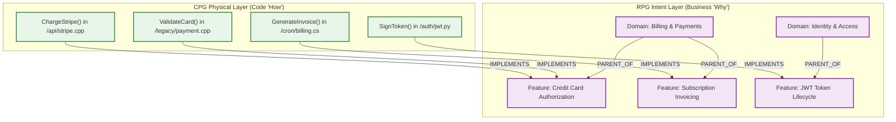
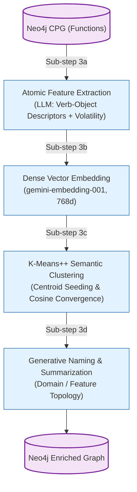

# Semantic Intent Layer (Repository Planning Graph)

## 1. Motivation: The "Why" vs. The "How"

In large legacy codebases, the physical organization of code (files, classes, folders) rarely reflects the actual business domains or developer intent.[^rpg-extractor] Over decades of maintenance:
* Single files grow into 5,000-line "God classes" spanning payment processing, reporting, and database queries.
* Feature logic becomes scattered across dozens of unrelated directories.
* Names of functions (e.g., `ProcessData2()`, `HandleInput()`) carry almost zero domain semantics.

To address this, the GraphDB Skill implements the **Repository Planning Graph (RPG)** framework.[^rpg-cluster] The RPG creates an **Intent Layer** that abstracts above physical files to group code into coherent business domains and features based on semantic meaning:



---

## 2. Four-Stage Construction Pipeline

The Intent Layer is constructed in Phase 3 of the build workflow through four sequential, resumable sub-steps:



---

## 3. Sub-step 3a: Atomic Feature Extraction

Rather than clustering raw function names or comments, the engine sends the actual implementation of each function to a generative model ([`internal/rpg/extractor.go`](file:///home/jasondel/dev/graphdb-skill/internal/rpg/extractor.go)).

### 3.1 Prompt Contract & Output Schema
The LLM evaluates the sliced function code and returns a structured JSON payload:
```json
{
  "descriptors": [
    "credit-card payment authorization",
    "fraud risk assessment",
    "stripe gateway integration"
  ],
  "is_volatile": true
}
```

### 3.2 Key Design Principles
1. **Verb-Object Decomposition:** The prompt strictly enforces a domain-first (Noun-Verb or Verb-Object) format. For example, `credit-card validation` rather than generic `validate`. This ensures functions cluster by the business entity they manipulate rather than generic programming activities.
2. **Multi-Descriptor Preservation for Legacy God Functions:** Legacy methods frequently perform multiple operations. The extractor outputs 1 to 5 descriptors per function. When vectorized, a God function sits at the intersection of those concepts in latent space rather than being artificially forced into a single bucket.
3. **External Volatility Seeding:** The LLM inspects whether the function performs database I/O, network calls, filesystem operations, or UI rendering, tagging it with `is_volatile: true`. This boolean flag seeds the downstream Phase 4 Contamination Analysis.
4. **Context Window Protection:** Functions exceeding 4,000 characters are safely sliced to prevent LLM context exhaustion.

---

## 4. Sub-step 3b: Dense Vector Embedding

Once atomic descriptors exist, the engine vectorizes each function into latent space ([`internal/rpg/embedder.go`](file:///home/jasondel/dev/graphdb-skill/internal/rpg/embedder.go)).[^rpg-embedder]

### 4.1 Embedding Standardization
* **Model:** `gemini-embedding-001` via Vertex AI.
* **Dimensions:** Standardized at **768 dimensions** across the ecosystem.
* **Index:** Cosine similarity vector index registered in Neo4j (`Function.embedding`).

### 4.2 Why Text Prioritization (`NodeToText`) Matters
Bare function names like `handleReq()` produce low-information embeddings that cluster with other generically named functions. The `NodeToText()` mapper prioritizes:
1. `atomic_features` (LLM-extracted verb-object descriptors)
2. Normalized function signature and parameters
3. Fallback to raw function name only if unextracted

---

## 5. Sub-step 3c: K-Means++ Semantic Clustering

The engine discovers natural architectural groupings by clustering function vectors ([`internal/rpg/cluster_semantic.go`](file:///home/jasondel/dev/graphdb-skill/internal/rpg/cluster_semantic.go)).

### 5.1 Dynamic Domain Sizing
The optimal number of top-level domains $K$ scales dynamically based on the total number of files in the codebase:
$$K = \text{clamp}\left(\left\lfloor \sqrt{\frac{\text{fileCount}}{5}} \right\rfloor, 5, 50\right)$$
This formula prevents small projects from fragmenting into dozens of tiny domains while ensuring million-line monoliths receive sufficient architectural separation.

### 5.2 K-Means++ Centroid Seeding
Standard K-Means is notorious for poor convergence when centroids initialize near one another. K-Means++ guarantees initial centroids are chosen with a probability proportional to their squared distance from existing centers:
$$P(x) = \frac{D(x)^2}{\sum_{x' \in X} D(x')^2}$$
This forces initial seeds to spread across distinct semantic territories (e.g., networking, database access, user authentication, UI dispatch).

### 5.3 File-Grounded Lowest Common Ancestor (LCA)
Pure vector clustering can occasionally group syntactically similar but physically disparate functions. The engine grounds clusters in the physical directory hierarchy using Lowest Common Ancestor (LCA) path resolution, ensuring discovered features maintain actionable file locality.

---

## 6. Sub-step 3d: Generative Naming & Summarization

Once vector clusters converge, the functions belonging to each cluster are passed to an LLM:
1. **Domain Naming:** The model assigns human-readable titles (e.g., `Authentication & Credential Management`, `Billing & Invoicing Engine`).
2. **Architectural Summarization:** Generates paragraph-length summaries stored on `Domain.description` and `Feature.description` explaining the subsystem's architectural role, dependencies, and business responsibilities.
3. **Fail-Fast Safety:** If the naming model encounters rate limits or errors, the pipeline halts immediately with an explicit error rather than injecting placeholder names like `Domain-UUID-1234`.

[^rpg-extractor]: [`extractor.go`](file:///home/jasondel/dev/graphdb-skill/internal/rpg/extractor.go)
[^rpg-cluster]: [`cluster_semantic.go`](file:///home/jasondel/dev/graphdb-skill/internal/rpg/cluster_semantic.go)
[^rpg-embedder]: [`embedder.go`](file:///home/jasondel/dev/graphdb-skill/internal/rpg/embedder.go)
