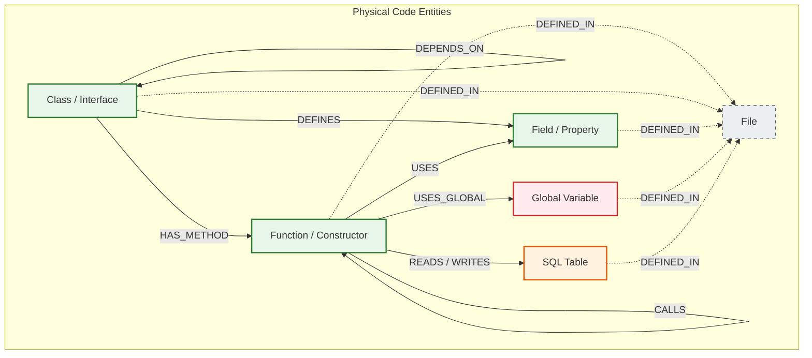

# Physical Code Property Graph (CPG) Specification

## 1. Overview & Purpose

The **Physical Code Property Graph (CPG)** models the syntactic and structural relationships directly present in raw source code.[^ingest-walker] In the GraphDB Skill, this layer is generated deterministically, quickly, and completely offline using CGO bindings to **Tree-sitter** grammar parsers. It commits physical code entities into **Neo4j 5.x** using transactional batch loaders.[^neo4j-loader]

The CPG serves as the foundational substrate for all downstream vector embeddings, community detection algorithms, and architectural modernization queries.

---

## 2. Graph Schema Contract

Neo4j is schemaless by design, but the GraphDB Skill strictly enforces a relational contract between the Ingestion Pipeline (Producers in [`internal/analysis/`](file:///home/jasondel/dev/graphdb-skill/internal/analysis)) and the Query Engine (Consumers in [`internal/query/`](file:///home/jasondel/dev/graphdb-skill/internal/query)).[^analysis-base]

### Visual Schema Diagram

---

## 3. Node Types and Property Reference

| Node Label | Description | Key Properties |
| :--- | :--- | :--- |
| `File` | Physical source file on disk. | `id` (relative path), `path`, `extension`, `lines`, `change_frequency` |
| `Class` | Class, struct, record, or module. | `id`, `name`, `file`, `start_line`, `end_line`, `is_interface` |
| `Interface` | Interface definition (Java, C#, TypeScript). | `id`, `name`, `file`, `start_line`, `end_line` |
| `Function` | Function, method, or procedure definition. | `id`, `name`, `file`, `start_line`, `end_line`, `signature`, `is_volatile`, `is_test`, `embedding` (768d), `fan_in`, `fan_out`, `volatility_score`, `risk_score` |
| `Constructor` | Class initialization constructor (Java, C#). | `id`, `name`, `file`, `start_line`, `end_line`, `signature` |
| `Field` | Member variable or class property. | `id`, `name`, `file`, `type`, `visibility` |
| `Global` | Global variable or static state variable. | `id`, `name`, `file`, `line`, `type` |
| `Table` | Relational database table parsed from SQL DDL. | `id`, `name`, `file`, `columns` (JSON string array) |

---

## 4. Edge Semantics & Behavioral Rules

### 4.1 Structural Edges
* `(:Class)-[:HAS_METHOD]->(:Function)`: Represents structural ownership. Indicates that the function or method is declared inside the class body.
* `(:Class)-[:DEFINES]->(:Field)`: Class ownership of member variables or fields.
* `(:Class)-[:EXTENDS]->(:Class)` / `[:IMPLEMENTS]->(:Interface)`: Object-oriented inheritance and interface fulfillment.
* `(:Class)-[:DEPENDS_ON]->(:Class)`: Type-level dependency, such as constructor parameter types (Dependency Injection) or member types.
* `(*)-[:DEFINED_IN]->(:File)`: Links every code element back to its physical origin file for fast filesystem slicing.

### 4.2 Invocation & Behavioral Edges
* `(:Function)-[:CALLS]->(:Function)`: Direct function or method invocation. Forms the primary directed call graph utilized by pathfinding, blast-radius queries, and community detection.
* `(:Function)-[:USES]->(:Field)`: Direct access to instance variables or class properties.
* `(:Function)-[:USES_GLOBAL]->(:Global)`: Represents code reading or mutating global state. Critical for finding hidden side-channel coupling between otherwise decoupled services.
* `(:Function)-[:TESTS]->(:Function)`: Links automated unit test functions to production functions.

---

## 5. Polyglot Language Extraction Matrix

The ingestion engine dispatches files across a concurrent worker pool, mapping extensions to specialized Tree-sitter parsers:

| Language | Exts | Tree-sitter Parser | Extracted Entities & Behaviors |
| :--- | :--- | :--- | :--- |
| **C / C++** | `.c`, `.cpp`, `.h`, `.hpp`, `.cc` | `tree-sitter-cpp` | Functions, constructors, function pointers, templates, structs, classes, namespaces, inheritance, and flat-symbol global variable access (`USES_GLOBAL`). |
| **C#** | `.cs` | `tree-sitter-c-sharp` | Classes, interfaces, methods, properties, fields, constructor Dependency Injection (`DISupport`), inheritance, namespace hierarchy. |
| **Java** | `.java` | `tree-sitter-java` | Classes, interfaces, methods, annotations, constructors, inheritance (`EXTENDS`, `IMPLEMENTS`), class fields. |
| **TypeScript / JS**| `.ts`, `.tsx`, `.js`, `.jsx` | `tree-sitter-typescript` | Functions, arrow functions, classes, interfaces, method calls, ES6 imports/exports. |
| **Python** | `.py` | `tree-sitter-python` | Sync & async functions, decorators, class inheritance, method calls, type annotations, global variable assignments. |
| **VB.NET / ASP** | `.vb`, `.asp`, `.inc` | Custom Tree-sitter regex / grammar | Subroutines, functions, classes, module-level variables, end-line boundaries. |
| **SQL** | `.sql` | `tree-sitter-sql` | `CREATE TABLE`, `CREATE VIEW`, primary keys, foreign keys, table-to-table joins. |

### Technical Boundary: AST vs. Full Compiler Frontend
The ingestion pipeline relies on Tree-sitter (syntactic analysis) rather than a complete compiler frontend (e.g., Roslyn, Clang LibTooling, or Java LSP):
* **Why Tree-sitter?** It parses broken or incomplete legacy code in milliseconds, requires zero project build files (`.csproj`, `CMakeLists.txt`, `pom.xml`), operates in an unconfigured environment, and runs completely offline.
* **Lexical Scope Trade-offs:** Accurately resolving method overloading and variable shadowing across deep inheritance chains in Java/TypeScript (e.g., differentiating local `count` from `this.count` or resolving dynamic runtime dispatch) is impossible with syntactic ASTs alone. 
* **Symbol Matching Heuristics:** The engine resolves cross-file invocations using qualified symbol matching within the active file's import declarations and global symbol namespace.

---

## 6. Incremental Ingestion & Database Sync

When analyzing large repositories during active development, re-parsing hundreds of thousands of unchanged files is wasteful:
1. `graphdb ingest -since-commit <HASH>` queries Git for changed files between `<HASH>` and `HEAD`.
2. Unchanged files are skipped entirely.
3. Changed files are re-parsed into an in-memory `Neo4jEmitter`.
4. Stale nodes and edges belonging to the modified files are purged from Neo4j, and updated entities are upserted atomically in a single Cypher transaction.

[^ingest-walker]: [`walker.go`](file:///home/jasondel/dev/graphdb-skill/internal/ingest/walker.go)
[^analysis-base]: [`types.go`](file:///home/jasondel/dev/graphdb-skill/internal/analysis/types.go)
[^neo4j-loader]: [`neo4j_loader.go`](file:///home/jasondel/dev/graphdb-skill/internal/loader/neo4j_loader.go)
