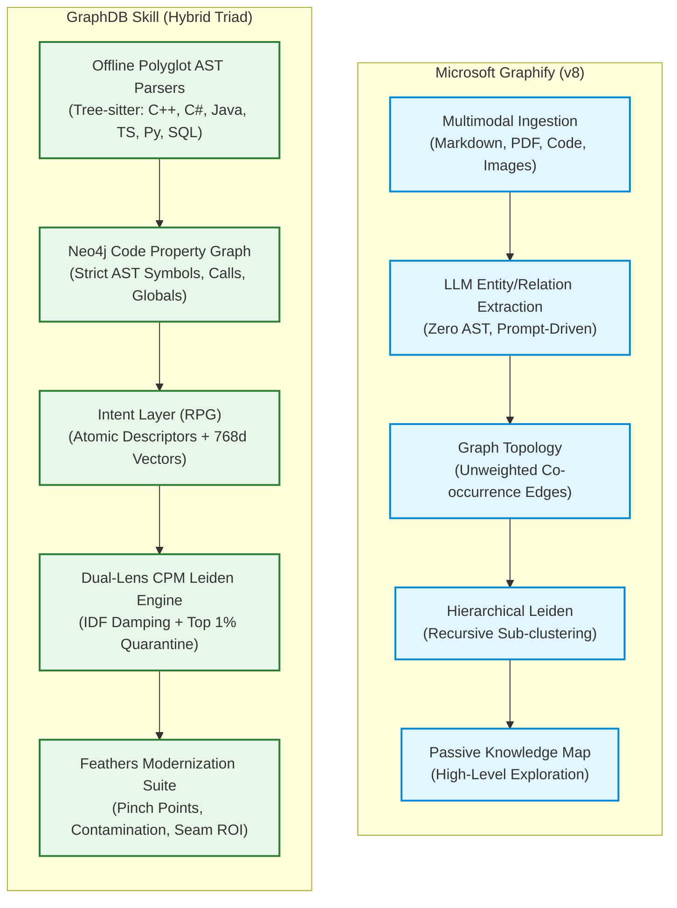

# Technical Comparison: Graphify vs. GraphDB Skill

## 1. Executive Summary

As AI-assisted coding evolves from simple inline completions to autonomous multi-agent refactoring, the underlying code graph representation dictates the system's reasoning capacity.[^graphify-v8]

This document provides a comparative analysis between **Microsoft Graphify (v8)** and the **GraphDB Skill**.[^graphdb-overview] While Graphify excels at general-purpose knowledge extraction from mixed multimodal assets, GraphDB Skill is specialized for **enterprise legacy software modernization, structural refactoring, and deterministic agent guidance**.

---

## 2. Multi-Dimensional Comparison Matrix

| Architectural Dimension | Microsoft Graphify (v8) | GraphDB Skill |
| :--- | :--- | :--- |
| **Primary Focus** | General-purpose multimodal knowledge discovery. | Enterprise legacy software modernization & refactoring. |
| **Ingestion Engine** | LLM-driven prompt extraction. Zero AST awareness. | High-performance offline CGO Tree-sitter AST parsers. |
| **Supported Codebases** | Any text/markdown file parsed uniformly. | Polyglot specialization (C++, C#, Java, TS, Py, ASP, VB, SQL). |
| **Entity Precision** | Coarse-grained textual chunks and heuristic entities. | Fine-grained symbols (`Class`, `Function`, `Global`, `Table`). |
| **State & Global Tracking**| Completely blind to shared mutable state. | Tracks `USES_GLOBAL` across files with degree damping. |
| **Database Backend** | In-memory graphs / GraphML / JSON exports. | Enterprise Neo4j 5.x with 768d vector index support. |
| **Semantic Intent Layer**| LLM cluster summaries over text chunks. | Structured **RPG**: Atomic Verb-Object decomposition. |
| **Embedding Standard** | Model-agnostic / Variable dimensionality. | Standardized on `gemini-embedding-001` (768 dimensions). |
| **Community Detection** | Vanilla Leiden Modularity. Vulnerable to hairball collapse. | **CPM Leiden** with Two-Tier Hub Suppression & BPR. |
| **Resolution Limit** | Suffers from $M \approx \sqrt{2m}$ microservice erasure. | **Resolution-Free Constant Potts Model (CPM)**. |
| **Refactoring Seams** | None. Reports high-level community clusters. | **Feathers Pinch Points & Actionable Seam Score**. |
| **Fragility Propagation**| None. | **Transitive Volatility Flood-Fill & Distance Decay**. |
| **Temporal Dynamics** | Static snapshot only. | Integrates **Git Churn & Co-Change Coupling**. |
| **Test Verification** | None. | Convention-based **`[:TESTS]` Linkage** to production code. |
| **Agent Swarm Role** | Informational RAG context. | **Autonomous Swarms**: Conflict-free work partitioning. |
| **Cost at Scale** | High ($O(N)$ LLM prompt calls for raw code syntax). | Low ($O(1)$ offline AST + batch vector embeddings). |

---

## 3. Deep Architectural Contrasts

### 3.1 Structural Rigor: AST vs. Text Prompts
* **Graphify:** Prompts an LLM to read chunks of code and generate entity/relation triples. This approach misses hidden call paths, confuses variable names with function calls, cannot parse deeply nested template syntax in C++, and fails completely on 10,000-line legacy files.
* **GraphDB Skill:** Utilizes compiled Tree-sitter parsers. Ingestion is 100% deterministic, extracts exact line numbers (`start_line`, `end_line`), resolves lexical symbol references, and runs at thousands of lines per second without spending a single API token.

### 3.2 Monolith Survivability: Hub Suppression vs. Hairball Collapse
* **Graphify:** Applies vanilla Leiden community detection directly to the graph. On real legacy systems, high-degree utility loggers and database contexts drag the entire graph into a single collapsed mega-cluster.
* **GraphDB Skill:** Employs **Two-Tier Hub Suppression** (Logarithmic IDF edge damping + Top 1% degree quarantine). The Leiden engine optimizes pure domain connectivity, reattaching infrastructure hubs post-partition as `:CrossCuttingHub` and `:SharedBoundary`.

### 3.3 Modernization Deliverables: Passive Maps vs. Actionable Seams
* **Graphify:** Delivers visual graphs and community summaries. While useful for human orientation, it provides zero guidance on *how* to decompose a monolith.
* **GraphDB Skill:** Delivers concrete refactoring recipes via the **Feathers Modernization Suite**:
  * Pinpoints exact chokepoints using **Pinch Points** ($\text{Fan-In} \times \text{Volatile Fan-Out}$).
  * Traces runtime instability using **Volatility Flood-Fill**.
  * Ranks microservice extraction candidates using the **Actionable Seam Score** ($\le 4$ cut-edges).

[^graphify-v8]: [`https://github.com/microsoft/graphify`](https://github.com/microsoft/graphify)
[^graphdb-overview]: [`hybrid-overview.md`](file:///architecture/hybrid-overview.md)
