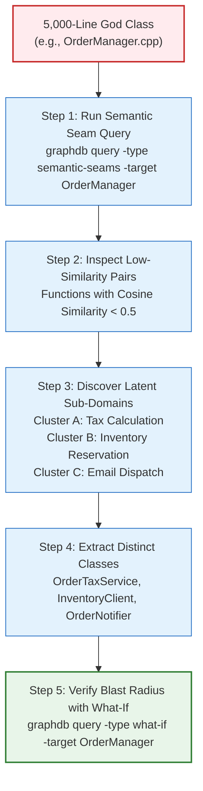
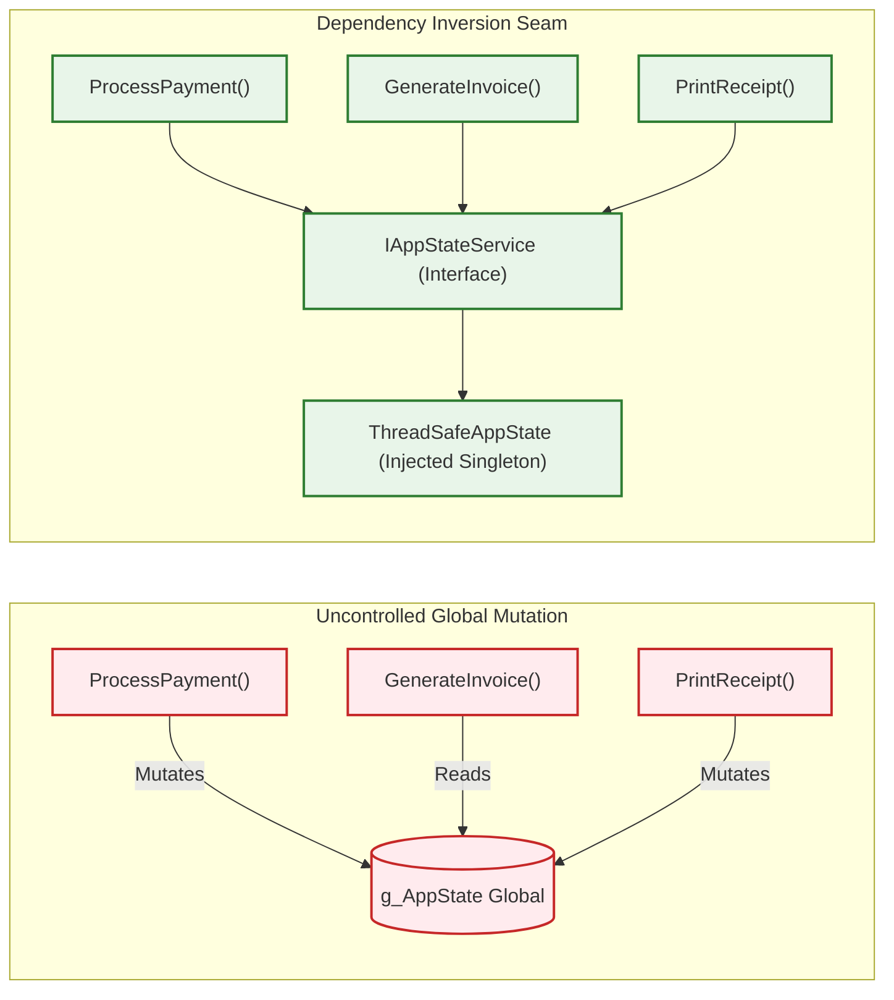
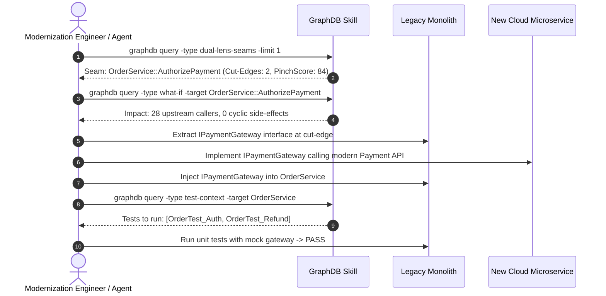

# Monolith Recovery: Modernizing 20-Year-Old Spaghetti Code

## 1. The Anatomy of Legacy Degeneration

Enterprise systems surviving over decades inevitably accumulate severe architectural debt:[^feathers-suite]
1. **The God Class / Omniscient Module:** Single files spanning 5,000–15,000 lines handling UI events, SQL queries, business math, and session caching.
2. **Global Mutable State:** Global structs, singletons, or static variables mutated across hundreds of functions without synchronization.
3. **Cyclic Entanglements:** Subsystem A calls Subsystem B, which in turn calls Subsystem A, making isolated testing mathematically impossible.

This guide details how engineers and AI agents use GraphDB Skill capabilities to systematically untangle these pathologies.[^seam-queries]

---

## 2. Playbook 1: Decomposing the God Class

### Execution Recipe
1. **Identify SRP Violations:** Run `graphdb query -type semantic-seams -target <ClassID>`. The engine compares vector embeddings between all member functions, flagging pairs with near-zero conceptual alignment.
2. **Group by Semantic Affinity:** Functions naturally cluster around distinct business entities (e.g., tax calculation vs. notification sending).
3. **Extract Cohesive Services:** Move clustered functions into dedicated classes with well-defined single responsibilities.

---

## 3. Playbook 2: Taming Shared Mutable Global State

Global state is the primary cause of non-linear regressions in legacy code:

### Execution Recipe
1. **Locate All Access Points:** Run `graphdb query -type globals -target <GlobalID>`. This returns every function reading or modifying the global state across the entire codebase.
2. **Separate Readers from Writers:** Categorize callers into read-only consumers versus mutating producers.
3. **Wrap in Interface Seam:** Encapsulate the global variable inside a managed service interface (`IAppStateService`). Inject this interface via constructor parameters, instantly enabling unit test mocks.

---

## 4. Playbook 3: The Strangler Fig Modernization Cycle

The **Strangler Fig Pattern** incrementally replaces parts of a legacy system until the old implementation is completely decommissioned.

1. **Find Highest-ROI Seam:** Query `dual-lens-seams` to identify boundaries with maximum caller protection and minimal cut-edges ($\le 4$).
2. **Simulate Blast Radius:** Execute `what-if` on the candidate seam function to verify that upstream callers are cleanly bounded.
3. **Introduce Interface:** Extract an interface at the exact cut-edge functions.
4. **Implement Modern Service:** Deploy the new implementation (e.g., modern microservice or cloud function) fulfilling the interface contract.
5. **Verify with Linked Tests:** Run `test-context` to identify and execute the exact test suite verifying the boundary.

[^feathers-suite]: [`feathers-modernization.md`](file:///architecture/feathers-modernization.md)
[^seam-queries]: [`query-catalog.md`](file:///guides/query-catalog.md)
