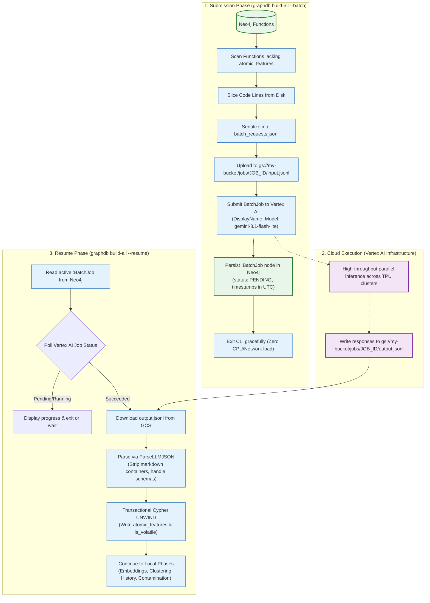

# Scaling to 100k+ Functions: Vertex AI Batch Prediction

## 1. The Scale Bottleneck of Real-Time REST APIs

Modernizing large enterprise repositories often entails parsing 50,000 to 200,000 distinct function definitions.[^batch-cmd] 

Attempting to process this volume through synchronous HTTP REST calls encounters severe operational obstacles:
* **Rate-Limit Throttling:** Client applications face HTTP 429 errors and exponential backoff retry storms.
* **Duration:** At a sustained concurrency of 10 requests/second, 100,000 functions require **nearly 3 hours** of continuous network connection. Any connection drop or client crash aborts the build.
* **Cost:** Interactive API calls are billed at standard on-demand pricing.

---

## 2. The Split-Phase Asynchronous Batch Architecture

To support massive enterprise monoliths, the GraphDB Skill provides native integration with the **Vertex AI Gemini Batch Prediction API** ([`internal/rpg/extractor_batch.go`](file:///home/jasondel/dev/graphdb-skill/internal/rpg/extractor_batch.go)):[^batch-extractor]



---

## 3. Implementation Hardening & Resilience

### 3.1 Markdown Code Block Stripping (`ParseLLMJSON`)
Large generative models occasionally wrap JSON outputs inside markdown code fences (````json ... ````) or append explanatory prose. The `ParseLLMJSON` parser cleans code fences, strips leading/trailing whitespace, and validates JSON syntax before unmarshalling:
```go
// Clean markdown fences if present
cleaned := strings.TrimSpace(rawOutput)
if strings.HasPrefix(cleaned, "```json") {
    cleaned = strings.TrimPrefix(cleaned, "```json")
    cleaned = strings.TrimSuffix(cleaned, "```")
} else if strings.HasPrefix(cleaned, "```") {
    cleaned = strings.TrimPrefix(cleaned, "```")
    cleaned = strings.TrimSuffix(cleaned, "```")
}
```

### 3.2 Dual-Schema Backwards Compatibility
The parser handles both modern structured payloads and legacy array formats:
```go
// Supports: {"descriptors": ["..."], "is_volatile": true}
// And legacy fallback: ["descriptor1", "descriptor2"]
```

### 3.3 UTC Timezone Enforcing
Neo4j's Cypher driver throws `Illegal zone identifier: "Local"` when serializing Go `time.Time` objects containing non-standard local timezone offsets. The batch loader explicitly converts all timestamps to UTC:
```go
now := time.Now().UTC()
```

---

## 4. Throughput & Cost Economics

| Metric | Synchronous Inline REST | Vertex AI Batch API | Advantage |
| :--- | :--- | :--- | :--- |
| **API Pricing** | 100% standard rate | **50% discount** on input & output tokens | **$2\times$ cheaper** |
| **Rate Limit Overhead** | Frequent 429 throttling & retries | Managed queue with dedicated batch quota | **Zero client throttling** |
| **Client Stability** | Machine must stay online for hours | Submit and disconnect; resume at will | **Zero client dependency** |
| **Throughput (100k functions)**| ~2.5 to 3.5 hours | ~15 to 30 minutes | **$6\times$ to $10\times$ faster** |

[^batch-extractor]: [`extractor_batch.go`](file:///home/jasondel/dev/graphdb-skill/internal/rpg/extractor_batch.go)
[^batch-cmd]: [`cmd_enrich_features.go`](file:///home/jasondel/dev/graphdb-skill/cmd/graphdb/cmd_enrich_features.go)
