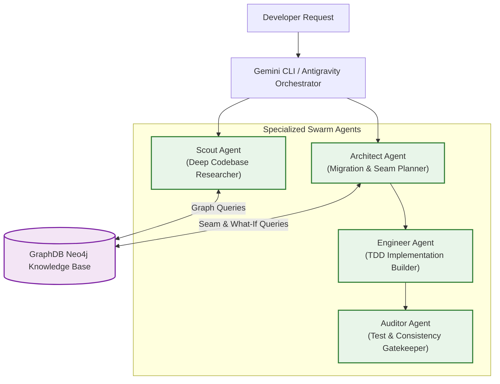
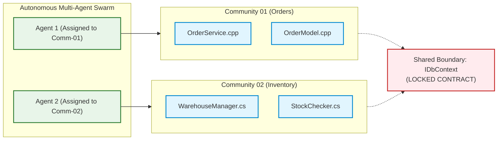

# Multi-Agent Swarm Orchestration & Personas

## 1. Overview & Token Economy

In standard LLM development, agents burn hundreds of thousands of tokens grepping files and reading entire source directories into context.[^scout-agent] 

The **GraphDB Skill** transforms agents from naive text-searchers into graph-aware navigators:[^skill-def]
* **Precise Context Slicing:** An agent queries `graphdb query -type hybrid-context -target <symbol>` to receive exactly the callers, callees, and semantic features relevant to the task in under 2,000 tokens.
* **Autonomous Exploration:** Agents traverse the architecture using domain trees (`explore-domain`) without touching raw files until implementation begins.

---

## 2. Agent Personas in the Ecosystem

### 2.1 The Scout Agent (`scout.md`)
* **Role:** Architectural cartographer and dependency researcher.
* **Primary Queries:** `search-features`, `explore-domain`, `neighbors`, `locate-usage`, `test-context`.
* **Behavior:** When asked *"How does the system calculate taxes for international orders?"*, Scout queries `search-features`, locates the relevant `Feature` node, retrieves its implementing functions, traces their downstream database calls, and returns an exact call graph to the developer.

### 2.2 The Architect Agent (`architect.md`)
* **Role:** Modernization strategist and refactoring planner.
* **Primary Queries:** `dual-lens-seams`, `seams`, `divergence`, `what-if`.
* **Behavior:** When asked *"How can we decouple the billing engine from legacy SQL singletons?"*, Architect queries `dual-lens-seams`, discovers high-ROI interface seams ($\le 4$ cut-edges), runs `what-if` to verify blast-radius containment, and generates a concrete step-by-step refactoring plan.

---

## 3. Conflict-Free Swarm Work Partitioning

When multiple autonomous coding agents work concurrently on a legacy monolith, they frequently collide—editing the same files or creating merge conflicts.

### Partitioning Along Leiden Communities
The engine uses **CPM Structural Communities** to partition swarm assignments:

1. **Independent Execution:** Agent 1 modifies files in Community 01, while Agent 2 modifies files in Community 02. Because cut-edges between communities are minimized by the CPM algorithm, collisions are virtually zero.
2. **Locked Boundary Contracts:** Any node classified as `:SharedBoundary` is locked. Neither agent is permitted to alter its signature unilaterally; modifications require an explicit interface proposal.

[^scout-agent]: [`.gemini/agents/scout.md`](file:///home/jasondel/dev/graphdb-skill/.gemini/agents/scout.md)
[^skill-def]: [`.gemini/skills/graphdb/SKILL.md`](file:///home/jasondel/dev/graphdb-skill/.gemini/skills/graphdb/SKILL.md)
