# Interactive Web Visualizer & Dual-Lens X-Ray

## 1. Overview & Launching

The GraphDB Skill bundles an embedded **D3.js Force-Directed Visualizer** directly inside the compiled Go binary.[^cmd-serve] 

To launch the web interface:
```bash
graphdb serve -port 8080
```
Open your browser to `http://localhost:8080` to interact with the live architecture map.[^ui-assets]

---

## 2. Interactive Map Capabilities

```mermaid
flowchart LR
    subgraph Controls ["Visualizer Overlay Controls"]
        O1["Domain Coloring (RPG Lens)"]
        O2["Community Convex Hulls (Leiden Lens)"]
        O3["Contamination Heatmap (Risk Halo)"]
        O4["Pinch Point Badges (Seams)"]
    end

    subgraph Views ["D3 Rendering Canvas"]
        V1["Force-Directed Graph Simulation"]
        V2["Convex Hull Boundary Polygons"]
        V3["Interactive Blast Radius Highlighting"]
    end

    subgraph Details ["Context Inspector Panel"]
        P1["Sliced Source Code Preview"]
        P2["Atomic Verb-Object Descriptors"]
        P3["Direct & Transitive Dependency Trees"]
    end

    Controls --> Views
    Views --> Details

    classDef c fill:#e3f2fd,stroke:#1565c0,stroke-width:1px;
    classDef v fill:#f3e5f5,stroke:#7b1fa2,stroke-width:2px;
    classDef d fill:#e8f5e9,stroke:#2e7d32,stroke-width:1px;

    class O1,O2,O3,O4 c;
    class V1,V2,V3 v;
    class P1,P2,P3 d;
```



---

## 3. Visual Layers & Symbology

### 3.1 Dual-Lens Community Convex Hulls
* **Physical Subsystems:** Discovered `:StructuralCommunity` clusters are rendered as translucent, colored convex hulls grouping their constituent member functions.
* **Shared Boundaries:** Nodes labeled `:SharedBoundary` sit visibly along the perimeter between adjacent hulls with prominent yellow indicators.
* **Cross-Cutting Hubs:** High-degree infrastructure nodes (such as loggers or global configs) appear with distinct purple halos and radiating dashed infrastructure lines.

### 3.2 Contamination & Risk Heatmap
* **Red Volatility Halos:** Nodes carrying runtime volatility (`is_volatile: true` or high `volatility_score`) display expanding red halos.
* **Halo Radius:** The size of the red ring scales proportionally with the calculated `risk_score`, instantly revealing the most fragile areas of the codebase.

### 3.3 Dynamic Edge Styles
* **Solid Arrows:** Direct `[:CALLS]` relationships.
* **Dashed Red Lines:** Global variable accesses (`[:USES_GLOBAL]`), alerting developers to hidden side-channel coupling.
* **Green Arrows:** Validated unit test invocations (`[:TESTS]`).

---

## 4. Node Inspection & Refactoring Triage

Clicking any function or class in the graph opens the **Inspector Panel**:
1. **Source Code Inspector:** Slices and displays the exact implementation from disk with syntax highlighting.
2. **Intent Descriptors:** Lists the LLM-extracted verb-object features (e.g., `validate-order`, `calculate-discount`).
3. **Interactive Blast Radius:** Clicking the *"Simulate Blast Radius"* button highlights all transitive upstream callers in gold, allowing developers to visually preview the impact of modifying that node.

[^cmd-serve]: [`cmd_serve.go`](file:///home/jasondel/dev/graphdb-skill/cmd/graphdb/cmd_serve.go)
[^ui-assets]: [`assets.go`](file:///home/jasondel/dev/graphdb-skill/internal/ui/assets.go)
