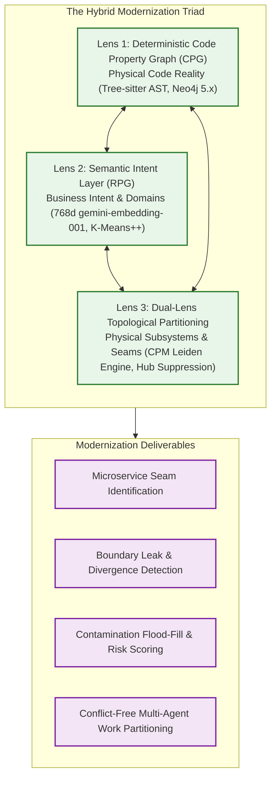

# GraphDB Skill Knowledge Catalog

Welcome to the definitive Open Knowledge Catalog for the **GraphDB Skill** ecosystem. 

Designed for the **Gemini CLI** and **Antigravity Multi-Agent Swarms**, the GraphDB Skill is an enterprise-grade architectural analysis and software modernization engine. It specializes in untangling multi-million-line polyglot legacy monoliths (C++, C#, Java, TypeScript, Python, ASP Classic, VB.NET, and SQL) by combining deterministic Code Property Graphs, dense semantic vector embeddings, and resolution-free topological community detection into a unified **Hybrid Modernization Triad**.

---

## Catalog Navigation

Explore the ecosystem through these specialized subdirectories:

* [architecture](architecture/index.md) - Core architectural foundations, graph data models, and the three layers of the Hybrid Triad.
* [pipeline](pipeline/index.md) - The complete six-phase data lifecycle transitioning raw source code into an enriched Neo4j knowledge graph.
* [algorithms](algorithms/index.md) - Formal mathematical formulations for Constant Potts Model Leiden, Two-Tier Hub Suppression, BPR, and Feathers Seam Ranking.
* [guides](guides/index.md) - Operational playbooks for installation, CLI command flags, 17 query capabilities, web visualization, and swarm orchestration.
* [computations](computations/index.md) - Sanctioned, attested graph computations for actionable seam scoring and volatility flood-fill.
* [deep-dives](deep-dives/index.md) - Deep architectural studies, including the Microsoft Graphify technical comparison and 100k+ function batch scaling.

---

## Architectural Highlights

### The Three Modernization Lenses
1. **Physical Reality (CPG):** High-speed, offline Tree-sitter parsers extract classes, functions, calls, global variable access, and SQL tables into Neo4j without requiring compiler toolchains. ([Learn more](architecture/physical-cpg.md))
2. **Business Intent (RPG):** Generative models slice function implementations to extract atomic verb-object descriptors, vectorized into 768-dimensional latent space and clustered into architectural domains. ([Learn more](architecture/intent-layer-rpg.md))
3. **Dual-Lens Topology (Leiden):** A pure Go implementation of the Constant Potts Model (CPM) Leiden algorithm with Two-Tier Hub Suppression and Boundary Participation Ratio (BPR), cross-examining physical wiring against semantic intent to surface high-ROI refactoring seams. ([Learn more](architecture/dual-lens-topology.md))

---

## Quick Reference Links

| User Goal | Recommended Starting Document |
| :--- | :--- |
| **New Developer Setup** | [Getting Started Guide](guides/getting-started.md) |
| **CLI & Query Cheat Sheet** | [Command-Line Interface Reference](guides/cli-reference.md) and [Query Catalog](guides/query-catalog.md) |
| **Untangling a Legacy Monolith** | [Monolith Recovery Playbook](deep-dives/legacy-monolith-recovery.md) |
| **Understanding the Leiden Math** | [CPM Leiden Engine](algorithms/cpm-leiden.md) and [Two-Tier Hub Suppression](algorithms/two-tier-hub-suppression.md) |
| **Configuring Multi-Agent Swarms** | [Swarm Orchestration Guide](guides/agent-orchestration.md) |
| **Comparing against Graphify** | [Technical Comparison Study](deep-dives/graphify-comparison.md) |
| **Audit Log of Changes** | [Bundle Log](log.md) |
