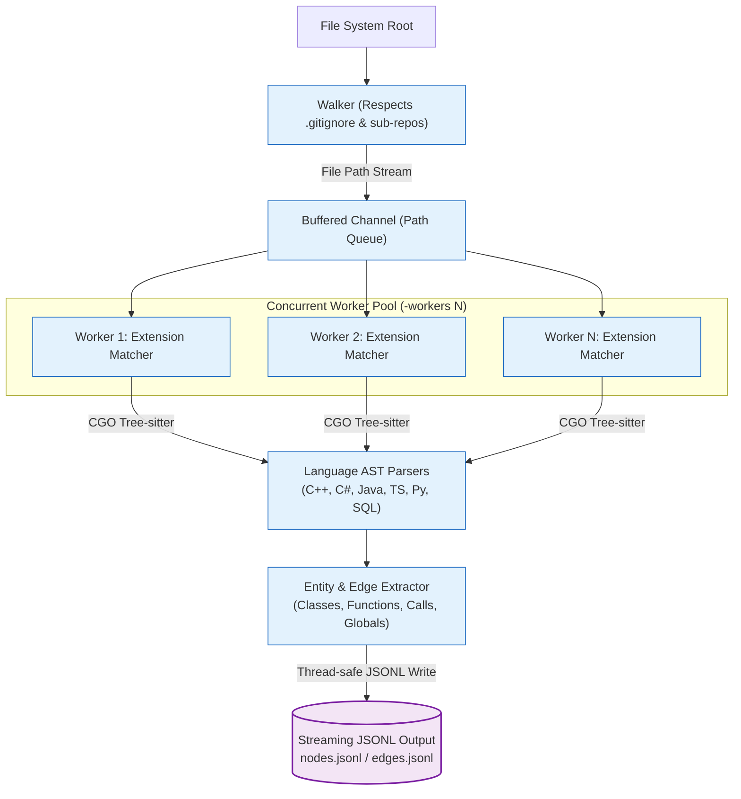

# Phase 1: Deterministic Structural Ingestion

## 1. Overview & Operational Contract

* **CLI Command:** `graphdb ingest -dir <source-path> [flags]`[^cmd-ingest]
* **Inputs:** Polyglot source code repository on disk.
* **Outputs:** Streaming JSONL files containing physical graph entities (`nodes.jsonl`, `edges.jsonl`).
* **Dependencies:** None. Completely offline — requires zero network access, zero cloud credentials, and no database connection.

Phase 1 converts raw source code into a normalized, language-agnostic Code Property Graph representation.[^walker-impl]

---

## 2. Ingestion Architecture & Execution Flow

---

## 3. Key Components & Implementation Details

### 3.1 Filesystem Walker (`internal/ingest/walker.go`)
* **Gitignore Compliance:** Dynamically loads and respects `.gitignore` rules at every directory depth. Build directories (`node_modules`, `bin`, `obj`, `target`, `dist`, `.venv`) are pruned before traversing.
* **Sub-repository Isolation:** Detects nested `.git` directories and Git worktrees to prevent traversing unrelated checkouts.
* **Worker Dispatch:** Dispatches discovered files across a configurable number of worker goroutines (defaults to runtime CPU core count via `-workers`).

### 3.2 Tree-sitter CGO Parsing
* Each worker selects the appropriate Tree-sitter grammar based on file extension.
* Generates a Concrete Syntax Tree (CST) in memory without executing build tools or compiler passes.
* Extracts code symbols:
  * Container types: `File`, `Class`, `Interface`, `Table`.
  * Executable blocks: `Function`, `Constructor`.
  * State variables: `Field`, `Global`.
  * Relational edges: `CALLS`, `USES`, `USES_GLOBAL`, `HAS_METHOD`, `DEFINES`, `EXTENDS`, `IMPLEMENTS`, `DEPENDS_ON`, `DEFINED_IN`.

### 3.3 Test Code Tagging
During AST traversal, test files and test functions are identified via structural conventions (e.g., `Test*`, `*Test`, `*_spec.js`, `@Test` annotations). These nodes are marked with `is_test: true`. This metadata ensures test code does not skew business domain clustering while enabling Phase 5 test-linkage analysis.

### 3.4 Streaming JSONL Serialization (`internal/storage/emitter.go`)
* Emits newline-delimited JSON (`nodes.jsonl` and `edges.jsonl`).[^jsonl-emitter]
* **Why decouple Ingestion from Import?**
  1. **CPU vs. I/O Separation:** Parsing is CPU-bound (Tree-sitter CGO), whereas loading into Neo4j is disk and I/O-bound. Decoupling allows independent performance optimization.
  2. **Auditability & Diffing:** Emitted JSONL can be inspected, piped to other tools, versioned, or reloaded into Neo4j without re-running AST parsing.
  3. **Zero Embedding Premature Optimization:** Bare function names lack semantic context. By omitting vector embeddings here, the pipeline ensures embeddings are created only after LLM atomic feature extraction in Phase 3.

---

## 4. CLI Flags Reference

| Flag | Default | Description |
| :--- | :--- | :--- |
| `-dir` | `.` | Root directory of the source code repository to ingest. |
| `-output` | `./graph_data` | Target directory for generated `nodes.jsonl` and `edges.jsonl`. |
| `-workers` | `runtime.NumCPU()` | Number of concurrent parsing workers. |
| `-since-commit`| `""` | Incremental mode: only parse files modified since the specified Git commit SHA. |

[^walker-impl]: [`walker.go`](file:///home/jasondel/dev/graphdb-skill/internal/ingest/walker.go)
[^cmd-ingest]: [`cmd_ingest.go`](file:///home/jasondel/dev/graphdb-skill/cmd/graphdb/cmd_ingest.go)
[^jsonl-emitter]: [`emitter.go`](file:///home/jasondel/dev/graphdb-skill/internal/storage/emitter.go)
