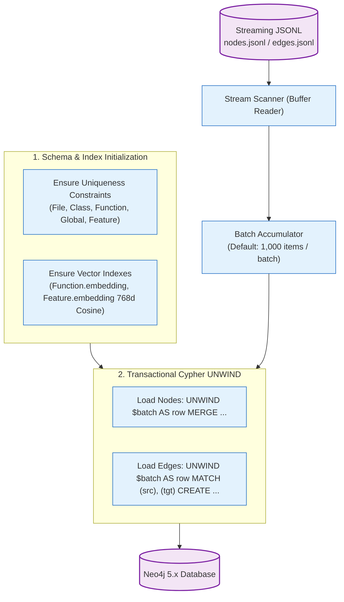

# Phase 2: Graph Loading & Index Persistence

## 1. Overview & Operational Contract

* **CLI Command:** `graphdb import -nodes <nodes.jsonl> -edges <edges.jsonl> [flags]`[^cmd-import]
* **Inputs:** Streaming JSONL files produced by Phase 1 Ingestion.
* **Outputs:** Fully indexed, persistent Code Property Graph in Neo4j 5.x.
* **Dependencies:** Running Neo4j Community Edition 5.x instance accessible via Bolt protocol.

Phase 2 manages the transactional loading of nodes, relationships, uniqueness constraints, and vector search indexes into Neo4j.[^neo4j-loader]

---

## 2. Ingestion Pipeline Architecture



---

## 3. Implementation Details

### 3.1 Constraint and Index Initialization (`internal/loader/neo4j_loader.go`)
Before streaming records, the loader asserts required database constraints:
1. **Uniqueness Constraints:** Guarantees primary key uniqueness on `id` across all labels:
   ```cypher
   CREATE CONSTRAINT IF NOT EXISTS FOR (f:Function) REQUIRE f.id IS UNIQUE;
   CREATE CONSTRAINT IF NOT EXISTS FOR (c:Class) REQUIRE c.id IS UNIQUE;
   CREATE CONSTRAINT IF NOT EXISTS FOR (file:File) REQUIRE file.id IS UNIQUE;
   CREATE CONSTRAINT IF NOT EXISTS FOR (feat:Feature) REQUIRE feat.id IS UNIQUE;
   CREATE CONSTRAINT IF NOT EXISTS FOR (comm:StructuralCommunity) REQUIRE comm.id IS UNIQUE;
   ```
2. **Vector Index Creation:** Creates high-performance vector search indexes for 768-dimensional embeddings:
   ```cypher
   CREATE VECTOR INDEX function_embedding_idx IF NOT EXISTS
   FOR (f:Function) ON (f.embedding)
   OPTIONS {indexConfig: {`vector.dimensions`: 768, `vector.similarity_function`: 'cosine'}};
   ```

### 3.2 High-Throughput Cypher `UNWIND` Pattern
Individual `CREATE` or `MERGE` queries incur immense network and transaction overhead. The loader buffers records into batches of 1,000 items and executes parameterized Cypher:
```cypher
UNWIND $batch AS item
MERGE (f:Function {id: item.id})
SET f.name = item.name,
    f.file = item.file,
    f.start_line = item.start_line,
    f.end_line = item.end_line,
    f.is_test = item.is_test
```
* **Why UNWIND?** It amortizes transaction commit overhead, achieving insertion speeds of 15,000–30,000 nodes/second on commodity hardware.

### 3.3 Clean-Slate Wipes (`--clean`)
When re-indexing a repository from scratch, old nodes and relationships can linger. Passing the `--clean` flag triggers `RecreateDatabase()`, which safely purges all data, constraints, and indexes before starting the import.

---

## 4. CLI Flags Reference

| Flag | Default | Description |
| :--- | :--- | :--- |
| `-nodes` | `graph_data/nodes.jsonl` | Path to JSONL file containing node definitions. |
| `-edges` | `graph_data/edges.jsonl` | Path to JSONL file containing relationship definitions. |
| `-batch-size` | `1000` | Number of records committed per Cypher transaction. |
| `-clean` | `false` | Wipe all existing nodes, relationships, and indexes before importing. |

[^cmd-import]: [`cmd_import.go`](file:///home/jasondel/dev/graphdb-skill/cmd/graphdb/cmd_import.go)
[^neo4j-loader]: [`neo4j_loader.go`](file:///home/jasondel/dev/graphdb-skill/internal/loader/neo4j_loader.go)
