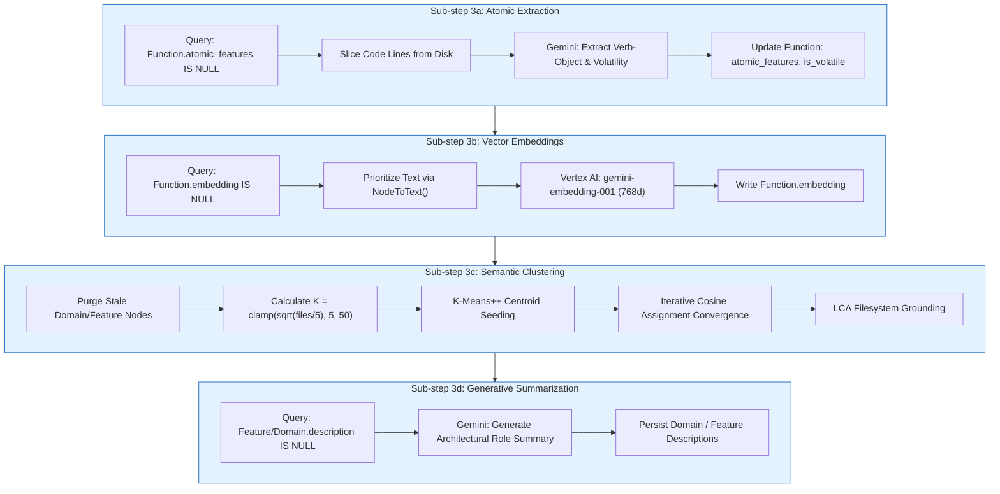
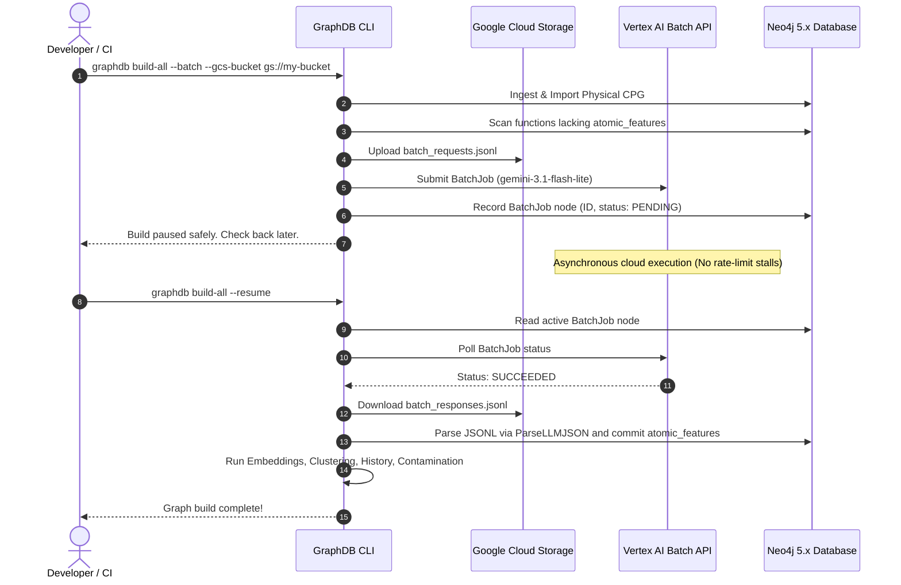

# Phase 3: Semantic RPG Intent Construction

## 1. Overview & Operational Contract

* **CLI Command:** `graphdb enrich-features [--batch] [--resume] [--gcs-bucket BUCKET]`[^cmd-enrich-features]
* **Inputs:** Neo4j database populated with physical `Function` nodes.
* **Outputs:** 
  1. Enriched `Function` nodes containing `atomic_features`, `is_volatile`, and 768d `embedding`.
  2. New `Domain` and `Feature` nodes linked via `PARENT_OF` and `IMPLEMENTS` relationships.
* **Dependencies:** Google Cloud Project credentials (`GOOGLE_CLOUD_PROJECT`), Vertex AI Gemini models (`gemini-embedding-001` and generative models).

Phase 3 is the semantic intelligence engine of the GraphDB Skill, lifting raw syntax into human- and agent-readable business concepts.[^cluster-engine]

---

## 2. Four Sub-Step Sequential Pipeline

Phase 3 executes four sub-steps sequentially. All sub-steps operate through database-backed resumable loops: they query for unprocessed nodes, process a chunk, write results back to Neo4j, and repeat.



---

## 3. Asynchronous Split-Phase Mode (Vertex AI Batch API)

Processing tens of thousands of legacy functions through real-time REST APIs can lead to rate limits and long execution times. GraphDB provides a native **Split-Phase Batch Workflow** using Vertex AI Batch Prediction:[^batch-extractor]



### Key Technical Hardening in Batch Parsing
* **Markdown Container Stripping:** Responses from generative models often include markdown code fences (````json ... ````). The `ParseLLMJSON()` helper cleans these fences to prevent unmarshalling failures.
* **Dual Schema Acceptance:** Supports both the current structured object format (`{"descriptors": [...], "is_volatile": true}`) and legacy descriptor arrays for backwards compatibility.
* **UTC Timestamp Normalization:** Converts `time.Now()` to explicit UTC (`time.Now().UTC()`) before writing to Neo4j to avoid `tz_id` serialization errors.

---

## 4. Sub-step Details

### Sub-step 3a: Atomic Extraction
* Slices exact function code from disk using the stored `file`, `start_line`, and `end_line` properties.
* Instructs the LLM to output 1–5 normalized verb-object descriptors (e.g., `authenticate-user`, `charge-credit-card`) and an `is_volatile` boolean.

### Sub-step 3b: Vector Embeddings
* Converts each function to text via `NodeToText()`, giving strict priority to `atomic_features` over raw function names.
* Generates 768-dimensional float32 vectors using `gemini-embedding-001` and commits them to Neo4j.

### Sub-step 3c: K-Means++ Clustering
* Cleans up existing `Feature` and `Domain` topology to guarantee idempotent builds.
* Computes optimal cluster count $K = \text{clamp}(\lfloor \sqrt{\text{fileCount}/5} \rfloor, 5, 50)$.
* Uses K-Means++ initialization to select maximally distant seeds across latent space.
* Assigns functions via Cosine Distance until centroid movement falls below convergence thresholds.
* Resolves directory locality using Lowest Common Ancestor (LCA) algorithms.

### Sub-step 3d: Summarization
* Queries for `Domain` and `Feature` nodes lacking descriptions.
* Generates concise, architectural summaries describing the purpose and boundaries of each logical group.

---

## 5. CLI Flags Reference

| Flag | Default | Description |
| :--- | :--- | :--- |
| `--batch` | `false` | Enable asynchronous Vertex AI Batch API mode. |
| `--resume` | `false` | Check status of active Batch API job and resume pipeline. |
| `--gcs-bucket` | `""` | GCS bucket for staging batch JSONL files (falls back to `GEMINI_BATCH_GCS_BUCKET` in `.env`). |
| `--concurrency`| `5` | Number of concurrent inline LLM requests when not using batch mode. |

[^cmd-enrich-features]: [`cmd_enrich_features.go`](file:///home/jasondel/dev/graphdb-skill/cmd/graphdb/cmd_enrich_features.go)
[^batch-extractor]: [`extractor_batch.go`](file:///home/jasondel/dev/graphdb-skill/internal/rpg/extractor_batch.go)
[^cluster-engine]: [`cluster_semantic.go`](file:///home/jasondel/dev/graphdb-skill/internal/rpg/cluster_semantic.go)
