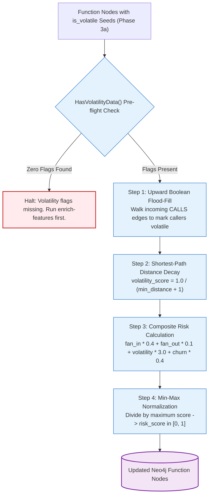

# Phase 4: Contamination & Risk Propagation

## 1. Overview & Operational Contract

* **CLI Command:** `graphdb enrich-contamination`[^cmd-enrich-contamination]
* **Inputs:** A populated Neo4j database where `Function` nodes possess `is_volatile` seed flags (from Phase 3a).
* **Outputs:** 
  * `is_volatile = true` propagated transitively upward through the call graph.
  * Distance-decayed `volatility_score` on all `Function` nodes.
  * Normalized `risk_score` on all `Function` nodes.
* **Dependencies:** Neo4j instance. Completely deterministic — requires **zero LLM tokens, zero API calls**, and completes in seconds.[^neo4j-contamination]

Phase 4 traces how runtime fragility (I/O, database access, network sockets, UI frameworks) cascades upward through the call graph to contaminate upstream business logic.

---

## 2. Contamination Propagation Flow



---

## 3. Algorithmic Steps & Cypher Logic

### 3.1 Pre-flight Guardrail (`HasVolatilityData`)
Before initiating graph traversal, the command verifies that the graph actually contains volatility annotations. If a user runs `enrich-contamination` on a raw, un-enriched CPG, the process fails fast with an actionable message directing them to run `graphdb enrich-features`.

### 3.2 Upward Boolean Flood-Fill
Cypher queries traverse incoming `[:CALLS*]` relationships starting from known volatile leaves:
```cypher
MATCH (volatile:Function {is_volatile: true})
MATCH (caller:Function)-[:CALLS*]->(volatile)
SET caller.is_volatile = true
```
Any function that depends on external I/O directly or transitively inherits the volatile classification.

### 3.3 Distance-Decayed Volatility Scoring
Topological distance from external systems dictates fragility:
$$\text{volatility\_score}(f) = \frac{1.0}{\text{distance}_{\text{min}}(f, \text{VolatileLeaf}) + 1}$$
* Direct database/network call ($\text{dist} = 0$): $\text{score} = 1.00$
* Calling function ($\text{dist} = 1$): $\text{score} = 0.50$
* Two hops away ($\text{dist} = 2$): $\text{score} = 0.33$
* Three hops away ($\text{dist} = 3$): $\text{score} = 0.25$

### 3.4 Composite Risk Scoring & Normalization
The engine combines structural connectivity, runtime volatility, and historical churn into a single unified risk metric:
$$\text{RawRisk}(f) = (\text{fan\_in} \cdot 0.4) + (\text{fan\_out} \cdot 0.1) + (\text{volatility\_score} \cdot 3.0) + (\text{churn} \cdot 0.4)$$
$$\text{risk\_score}(f) = \frac{\text{RawRisk}(f)}{\max_{g \in \text{Functions}}(\text{RawRisk}(g))}$$
* A score of `1.0` represents the most critical hotspot in the entire repository.
* High risk indicates a function that is heavily called, calls volatile dependencies, and changes frequently in Git.

---

## 4. Pinch Point Identification

Pinch points represent natural architectural seams where dependency inversion should be applied:
$$\text{PinchScore}(f) = \text{InternalFanIn}(f) \times \text{VolatileFanOut}(f)$$
* Functions with high internal fan-in and high volatile fan-out are the prime candidates for introducing interfaces or mocks.
* Refactoring a high-pinch function yields immediate unit testability for all upstream callers.

[^cmd-enrich-contamination]: [`cmd_enrich_contamination.go`](file:///home/jasondel/dev/graphdb-skill/cmd/graphdb/cmd_enrich_contamination.go)
[^neo4j-contamination]: [`neo4j_contamination.go`](file:///home/jasondel/dev/graphdb-skill/internal/query/neo4j_contamination.go)
