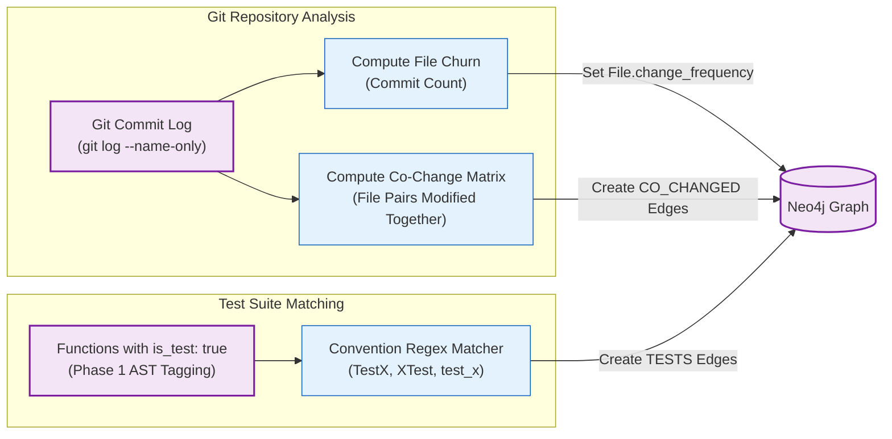

# Phase 5: Temporal History & Test Linkage

## 1. Overview & Operational Contract

* **CLI Commands:**
  * `graphdb enrich-history -dir <repo-path>` (Git History)[^neo4j-history]
  * `graphdb enrich-tests` (Test Linkage)[^neo4j-tests]
* **Inputs:** 
  1. Git commit log of the target repository.
  2. Neo4j database containing `File` and `Function` nodes.
* **Outputs:** 
  * `change_frequency` property on `File` nodes.
  * Temporal co-change relationships between files.
  * `[:TESTS]` relationships linking test functions to production functions.
* **Dependencies:** Local Git repository and running Neo4j instance. Zero external API calls.

Phase 5 enriches the static Code Property Graph with temporal developer dynamics and verification coverage.

---

## 2. Temporal Analysis Architecture



---

## 3. Sub-Phase 5a: Git History Enrichment (`enrich-history`)

### 3.1 Churn Frequency
The engine parses the local Git commit history to tally modifications per file:
* Files with high churn (`change_frequency > 50`) are persistent vectors of instability.
* Churn acts as a weighting factor in the Phase 4 Composite Risk Score.

### 3.2 Co-Change Coupling
Static analysis alone cannot detect files that change together due to implicit contracts (e.g., an XML configuration file that always updates alongside a database repository class, or two decoupled services sharing a database schema).
* The engine slides a window over multi-file commits.
* If file pair $(F_1, F_2)$ appears together in more than a threshold percentage of commits, an implicit dependency is recorded.
* These co-change signals feed into the Leiden adjacency graph to ensure temporally entangled files are clustered together.

---

## 4. Sub-Phase 5b: Test Linkage (`enrich-tests`)

### 4.1 Convention-Based Target Resolution
Functions marked `is_test: true` during Phase 1 AST parsing are matched against production functions using cross-language conventions:
* Prefix patterns: `TestFoo()` $\rightarrow$ `Foo()`
* Suffix patterns: `FooTest()`, `Foo_ShouldReturnTrue()` $\rightarrow$ `Foo()`
* Python snake_case: `test_calculate_tax()` $\rightarrow$ `calculate_tax()`
* BDD spec files: `*.spec.ts`, `*_spec.rb` $\rightarrow$ Target class methods

### 4.2 Creating `[:TESTS]` Relationships
Matching pairs are committed to Neo4j via transactional `MERGE`:
```cypher
MATCH (t:Function {is_test: true, name: $testName})
MATCH (p:Function {is_test: false, name: $targetName})
MERGE (t)-[:TESTS]->(p)
```

### 4.3 Modernization Impact
This linkage allows agents to answer critical questions:
* Which production functions lack any test coverage?
* When refactoring function $F$, which automated tests must be executed to verify the change?
* Are unit tests physically coupled to volatile external systems?

[^neo4j-history]: [`neo4j_history.go`](file:///home/jasondel/dev/graphdb-skill/internal/query/neo4j_history.go)
[^neo4j-tests]: [`neo4j_tests.go`](file:///home/jasondel/dev/graphdb-skill/internal/query/neo4j_tests.go)
