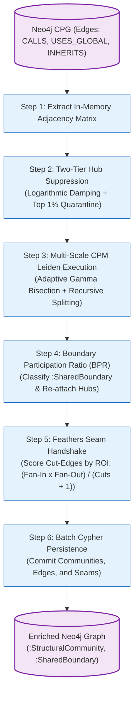

# Phase 6: Dual-Lens Topological Partitioning

## 1. Overview & Operational Contract

* **CLI Command:** `graphdb enrich-topology [flags]`[^cmd-enrich-topology]
* **Inputs:** Populated Neo4j database with structural relationships (`CALLS`, `USES_GLOBAL`, `INHERITS`, `CO_CHANGED`).
* **Outputs:**
  * `:StructuralCommunity` nodes representing physical code subsystems.
  * `[:IN_COMMUNITY]` edges mapping `Function` nodes to communities.
  * `:SharedBoundary` labels on infrastructure nodes with `[:BRIDGES]` edges.
  * `:CrossCuttingHub` labels on quarantined high-degree hubs with `[:INFRASTRUCTURE_OF]` edges.
  * Dual-Lens divergence metrics comparing physical communities against semantic RPG domains.
* **Dependencies:** Neo4j instance. Completely offline — **zero external API calls, zero LLMs**.[^leiden-engine]

Phase 6 executes the **Dual-Lens Topological Partitioning Engine**, grouping code by dense structural call topology while applying anti-collapse guardrails tailored for legacy spaghetti code.

---

## 2. Six-Step Pipeline Execution Flow

---

## 3. Implementation Details & Algorithmic Steps

### Step 1: In-Memory Adjacency Matrix Extraction
The engine streams all structural relationships (`CALLS`, `USES_GLOBAL`, `INHERITS`, and optional `CO_CHANGED`) from Neo4j into an in-memory graph representation optimized for fast neighbor traversals and degree lookups.

### Step 2: Two-Tier Hub Suppression
1. **Logarithmic Edge Damping:** Call edges connected to high-degree nodes are dynamically damped:
   $$W_{\text{eff}}(u, v) = W_{\text{base}}(u, v) \cdot \frac{1}{\ln(1 + \text{deg}(u)) \cdot \ln(1 + \text{deg}(v))}$$
2. **Top 1% Degree Quarantine:** Nodes with degree exceeding $\mu + 3\sigma$ (e.g., global loggers, utility string formatters, generic error handlers) are quarantined from the adjacency matrix during community optimization to prevent hairball collapse.

### Step 3: Multi-Scale CPM Leiden Execution
1. **Constant Potts Model Optimization:** Evaluates partition quality using the resolution-free CPM quality function:
   $$\mathcal{H}_{\text{CPM}} = -\sum_c \left[ e_c - \gamma \binom{n_c}{2} \right]$$
2. **Dynamic $\gamma$ Bisection Search:** Unless overridden by `-gamma`, the engine runs an automated bisection search over $\gamma \in [0.001, 0.5]$ to find the resolution parameter that produces communities within the target microservice range ($30 \le \text{size} \le 250$).
3. **Recursive Hierarchical Splitting:** Any community exceeding 300 nodes is recursively partitioned with a higher local resolution ($\gamma_{\text{local}} = 1.5 \cdot \gamma_{\text{parent}}$).
4. **Deterministic Seed:** The `-seed` flag seeds the pseudo-random number generator, guaranteeing identical partition IDs across runs.

### Step 4: BPR Classification & Hub Re-attachment
1. Quarantined hubs are evaluated for Boundary Participation Ratio:
   $$\text{BPR}(v, c_k) = \frac{|\{u \in c_k \mid (v, u) \in E\}|}{\text{deg}(v)}$$
2. Nodes with $\text{BPR} \ge 0.25$ spanning two or more communities are labeled `:SharedBoundary` and connected via `[:BRIDGES]` edges.
3. Universal hubs spanning nearly all communities are labeled `:CrossCuttingHub` and reattached via `[:INFRASTRUCTURE_OF]` edges.

### Step 5: Feathers Seam Handshake
The engine computes cut-edges traversing community boundaries and ranks them via the **Actionable Seam Score**:[^seam-ranker]
$$\text{ActionableSeamScore} = \frac{\text{Internal Fan-In} \times \text{Volatile Fan-Out}}{\text{Cut-Edges} + 1}$$
This filters out diffuse, high-cut-edge legacy entanglements, elevating only those seams that can be cleanly refactored behind 1–4 interface contracts.

### Step 6: Transactional Cypher Persistence
Communities, community memberships, and seam metrics are written back to Neo4j in parameterized Cypher transactions.

---

## 4. CLI Flags Reference

| Flag | Default | Description |
| :--- | :--- | :--- |
| `-gamma` | `0.0` (Auto) | CPM resolution parameter. Defaults to dynamic bisection search. |
| `-min-size` | `30` | Target minimum node count per community during bisection search. |
| `-max-size` | `250` | Target maximum node count per community during bisection search. |
| `-seed` | `42` | Random seed for deterministic partition reproducibility. |
| `-suppress-hubs` | `true` | Enable two-tier logarithmic edge damping and top 1% quarantine. |
| `--offline` | `true` | Pure local execution mode (requires zero LLM credentials). |

[^cmd-enrich-topology]: [`cmd_enrich_topology.go`](file:///home/jasondel/dev/graphdb-skill/cmd/graphdb/cmd_enrich_topology.go)
[^leiden-engine]: [`engine.go`](file:///home/jasondel/dev/graphdb-skill/internal/analysis/leiden/engine.go)
[^seam-ranker]: [`seam_ranker.go`](file:///home/jasondel/dev/graphdb-skill/internal/analysis/seam_ranker.go)
