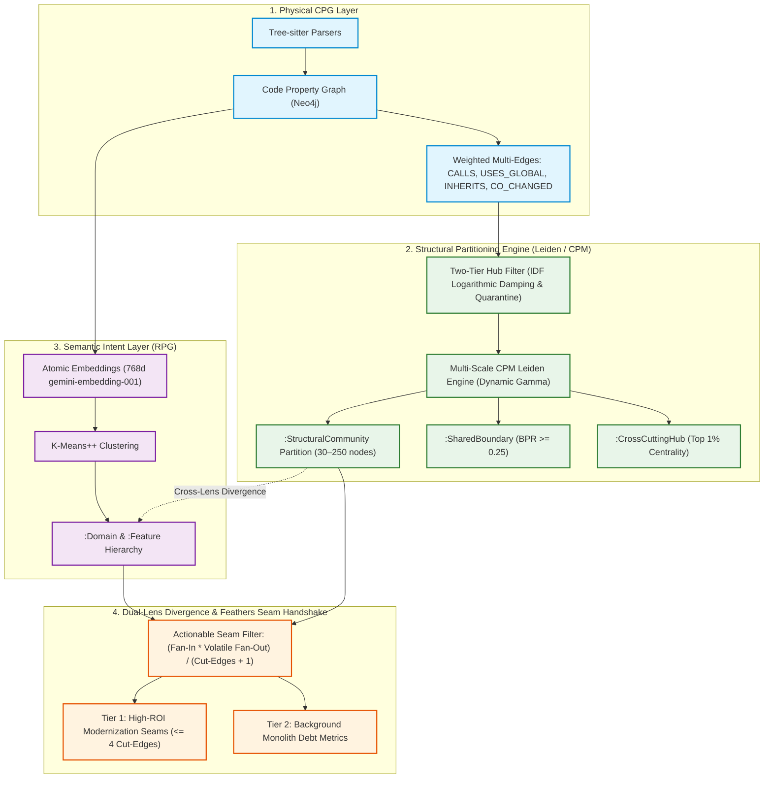

# Campaign 20: Dual-Lens Structural Partitioning (CPM Leiden & Feathers Handshake)

**Status:** Completed  
**Architecture Lead:** Principal Systems Architect & Adversarial Review Team  
**Dependencies:** CPG Ingestion (Phase 1), Neo4j Persistence (Phase 2), RPG Semantic Layer (Campaign 3.8), Feathers Suite (Campaign 11)  

---

## 🎯 Strategic Objective

Establish a high-performance **Structural Topological Layer** using the **Constant Potts Model (CPM) Leiden Community Detection** algorithm in pure Go. 

This creates a **"Dual-Lens" Architecture** that contrasts **Physical Reality** (how code is coupled via runtime calls, inheritance, and shared mutable state) against **Business Intent** (what code was intended to do via RPG semantic vector embeddings).

---

## 🛡️ Adversarial Review Guardrails & Mathematical Formulations

### 1. Two-Tier Hub Suppression (Neutralizing "Hairball Collapse")
To prevent ubiquitous utility functions (`Logger.Log()`, `AppConfig`, `StringHelper`) from pulling unrelated business logic into one 80% mega-cluster:
1. **Inverse-Degree Logarithmic Edge Damping (IDF Coupling):**
   $$W_{\text{eff}}(u, v) = W_{\text{base}}(u, v) \cdot \frac{1}{\ln(1 + \text{deg}(u)) \cdot \ln(1 + \text{deg}(v))}$$
2. **Top 1% Hub Quarantine:**
   Nodes with degree $> \mu + 3\sigma$ are quarantined during the partition optimization and attached post-clustering as `(:Class:CrossCuttingHub)` or `(:Function:CrossCuttingHub)` with `[:INFRASTRUCTURE_OF]->(:StructuralCommunity)`.

### 2. Resolution-Free Constant Potts Model (CPM)
Standard Newman-Girvan modularity optimization ($Q$) suffers from the **Resolution Limit** ($M \approx \sqrt{2m}$), blindly merging 20–50 function microservices into giant blobs. We formulate the quality function using CPM:
$$\mathcal{H}_{\text{CPM}} = -\sum_c \left[ e_c - \gamma \binom{n_c}{2} \right]$$
* **Dynamic Resolution ($\gamma$):** Bisection search dynamically adapts $\gamma$ to target enterprise microservice candidate sizes ($30 \le N_{\text{comm}} \le 250$).
* **Recursive Hierarchical Partitioning:** Clusters with $N > 300$ trigger an automatic sub-graph Leiden pass with $\gamma_{\text{local}} = 1.5 \cdot \gamma_{\text{parent}}$.

### 3. Boundary Participation Ratio (BPR for Shared Infrastructure)
Shared components (e.g. `TransactionManager`, `DomainEventBus`, `BaseRepository`) are prevented from being forced into arbitrary silos:
$$\text{BPR}(v, c_k) = \frac{\sum_{u \in c_k} W_{\text{eff}}(v, u)}{\sum_{u \in V} W_{\text{eff}}(v, u)}$$
* Nodes with $\text{BPR}(v, c_k) \ge 0.25$ across $\ge 2$ communities are labeled `(:SharedBoundary)` with `[:BRIDGES {ratio: float}]->(:StructuralCommunity)`.

### 4. Feathers Modernization Handshake (Eliminating Alert Fatigue)
Domain divergence is filtered through the **Feathers Pinch Point Engine** to eliminate false-alarm noise:
$$\text{ActionableSeamScore}(S) = \frac{\text{Internal Fan-In} \times \text{Volatile Fan-Out}}{\text{Cut-Edge Count} + 1}$$
* **Tier 1 (Actionable Seam Recipes):** Only surfaced when $\text{Cut-Edges} \le 4$ and $\text{ActionableSeamScore} \ge 10.0$.
* **Tier 2 (Background Monolith Debt):** Diffuse leaks with $\text{Cut-Edges} > 10$ are rolled into domain health metrics rather than generating individual alerts.

---

## 📦 Key Deliverables & Implementation Phases

### Phase 1: Pure Go CPM Leiden Engine (`internal/analysis/leiden/`)
- [x] Implement in-memory graph representation with weighted typed edges.
- [x] Implement Inverse-Degree Logarithmic Edge Damping & Degree Centrality calculation.
- [x] Implement Constant Potts Model (CPM) Leiden partitioner with deterministic seed support (`-seed 42`).
- [x] Implement adaptive $\gamma$ search and recursive hierarchical sub-clustering.
- [x] Implement Boundary Participation Ratio (BPR) calculator.
- [x] Unit tests on synthetic monolith and benchmark graphs (`leiden_test.go`).

### Phase 2: Ingestion & Neo4j Graph Schema Persistence
- [x] Add `:StructuralCommunity`, `:SharedBoundary`, and `:CrossCuttingHub` node definitions in `internal/graph/schema.go`.
- [x] Add Cypher batch writers in `internal/loader/` using `UNWIND` batches.
- [x] Connect CLI command `graphdb enrich-topology` with flags (`-gamma`, `-min-size`, `-max-size`, `-suppress-hubs`).
- [x] Implement `--offline` / `--quick` fast-path for zero-token air-gapped monolith indexing.

### Phase 3: Dual-Lens Divergence & Feathers Seam Handshake
- [x] Implement `internal/analysis/divergence.go` comparing `:StructuralCommunity` vs `:Domain`.
- [x] Implement Seam Actionability ranker integrating `GetSeams` ([`neo4j.go:GetSeams`](file:///home/jasondel/dev/graphdb-skill/internal/query/neo4j.go#L657-L742)).
- [x] Register CLI query commands in `cmd/graphdb/cmd_query.go`:
  - `graphdb query seams --dual-lens`
  - `graphdb query divergence --domain <name>`
  - `graphdb query communities`

### Phase 4: Web Visualizer & Agent Swarm Integration
- [x] Update D3 force-directed visualizer (`internal/ui/web/`) with a "Dual-Lens Architecture X-Ray" overlay.
- [x] Add visual convex hull bubbles for `:StructuralCommunity` partitions with internal semantic domain coloring.
- [x] Update Scout and Architect agent prompts in `.gemini/agents/` to use structural community boundaries for conflict-free subagent dispatch.

---

## 🧪 Verification & Acceptance Criteria
1. **Hairball Test:** A benchmark codebase with 10,000 nodes and 10 pervasive loggers/globals produces $\ge 15$ distinct business communities, with no single community exceeding 25% of the total node count.
2. **Resolution Test:** Small synthetic sub-modules (25–40 functions) are cleanly isolated as independent communities rather than merged.
3. **Determinism Test:** 10 consecutive runs with the same `-seed` produce identical node-to-community assignments.
4. **Feathers Seam Test:** `graphdb query seams --dual-lens` surfaces valid interface extraction points with $\le 4$ cut-edges on legacy test repositories.
