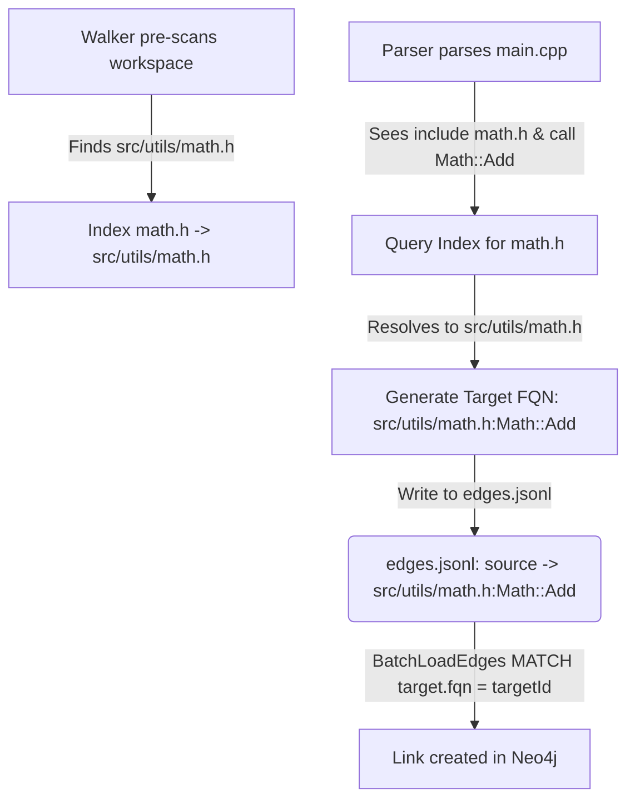

# Design Document: Resolving Cross-File Call Hierarchy via Workspace Include Mapping

This document details the design and implementation specification for resolving cross-file function calls in C++ and Python at ingestion time. It specifies the **Workspace Include / Module Mapping Pattern**, which indexes header files and modules during traversal to resolve import/include targets to absolute workspace paths.

---

## 1. Overview & Problem Statement

The GraphDB ingestion pipeline parses codebase files using **Tree-sitter**. Because each file is parsed in isolation, the parser lacks global context and cannot resolve where imported or included symbols are declared.

### The Problem

1.  **C++ Call Targets:** When `main.cpp` calls `Math::Add()`, the C++ parser resolves the target of the call as `"Math::Add"` (unqualified by file) because it doesn't know which absolute header path `math.h` maps to.
2.  **C++ FQN Structure:** The actual declaration node for `Math::Add` in `math.h` is stored in the database with an FQN that includes its relative path: `"src/utils/math.h:Math::Add"`.
3.  **Edge Ingestion Failure:** The loader imports edges by matching `target.id` or `target.fqn` against the edge's `targetId`:
    ```cypher
    MATCH (target:CodeElement) WHERE target.id = row.targetId OR target.fqn = row.targetId
    ```
    Because the edge's `targetId` is `"Math::Add"` but the actual node's FQN is `"src/utils/math.h:Math::Add"`, the match fails, and the edge is discarded.

### The Solution: Workspace Include Mapping

Instead of post-processing the database, we build a **Workspace Index** during the initial file traversal. This index maps header filenames and module names to their relative file paths. When the parser encounters an external call, it resolves the import/include to its source file path and generates the exact target FQN, allowing the database loader to match it natively without changing the Neo4j schema or queries.

---

## 2. Architecture & Data Structures



### 2.1. The WorkspaceIndex Struct
We introduce a thread-safe `WorkspaceIndex` struct to hold the resolved mappings:

```go
// internal/analysis/index.go
package analysis

import (
	"path/filepath"
	"strings"
	"sync"
)

type WorkspaceIndex struct {
	mu         sync.RWMutex
	// Maps lowercase header filename to a list of possible workspace-relative paths
	// e.g. "math.h" -> ["src/utils/math.h", "src/contrib/math.h"]
	CppHeaders map[string][]string
	// Maps Python module dot-paths to their workspace-relative file paths
	// e.g. "jobs.module" -> "src/jobs/module.py"
	PyModules  map[string]string
}

func NewWorkspaceIndex() *WorkspaceIndex {
	return &WorkspaceIndex{
		CppHeaders: make(map[string][]string),
		PyModules:  make(map[string]string),
	}
}

func (idx *WorkspaceIndex) AddHeader(path string) {
	idx.mu.Lock()
	defer idx.mu.Unlock()
	base := strings.ToLower(filepath.Base(path))
	idx.CppHeaders[base] = append(idx.CppHeaders[base], path)
}

func (idx *WorkspaceIndex) AddPythonModule(path string) {
	idx.mu.Lock()
	defer idx.mu.Unlock()
	
	// e.g. path = "src/jobs/module.py"
	ext := filepath.Ext(path)
	cleanPath := strings.TrimSuffix(path, ext) // "src/jobs/module"
	
	// Register variations of module names
	parts := strings.Split(cleanPath, "/")
	for i := 0; i < len(parts); i++ {
		moduleName := strings.Join(parts[i:], ".")
		idx.PyModules[moduleName] = path
	}
}
```

---

## 3. Implementation Specification

### 3.1. Walker Changes (Pre-Scanning)
We update the ingestion `Walker` in [walker.go](file:///usr/local/google/home/jasondel/dev/graphdb-skill/internal/ingest/walker.go) to pre-scan the directory structure before launching the parallel workers.

```go
// internal/ingest/walker.go
func (w *Walker) Run(ctx context.Context, dirPath string) error {
	index := analysis.NewWorkspaceIndex()
	
	// Pre-scan directories to populate the index
	err := w.Walk(ctx, dirPath, func(path string, d fs.DirEntry) error {
		if d.IsDir() {
			return nil
		}
		relPath, err := filepath.Rel(dirPath, path)
		if err != nil {
			relPath = path
		}
		relPath = filepath.ToSlash(relPath)
		ext := strings.ToLower(filepath.Ext(path))
		
		switch ext {
		case ".h", ".hpp", ".hxx", ".hh":
			index.AddHeader(relPath)
		case ".py":
			index.AddPythonModule(relPath)
		}
		return nil
	})
	if err != nil {
		return fmt.Errorf("failed to pre-scan workspace: %w", err)
	}

	// Share the index globally via package level context or passing down
	analysis.CurrentIndex = index

	w.WorkerPool.Start()
	defer w.WorkerPool.Stop()
	// ... rest of Run remains unchanged ...
}
```

---

### 3.2. C++ Symbol Resolution Algorithm

We modify `resolveCppInclude` in [cpp.go](file:///usr/local/google/home/jasondel/dev/graphdb-skill/internal/analysis/cpp.go) to query the index and resolve the absolute FQN.

```go
// internal/analysis/cpp.go
func resolveCppInclude(symbol string, includes []string, currentFile string) string {
	symbolBase := symbol
	if idx := strings.Index(symbol, "::"); idx != -1 {
		symbolBase = symbol[:idx]
	}

	var matchedInclude string
	for _, inc := range includes {
		base := filepath.Base(inc)
		ext := filepath.Ext(base)
		name := strings.TrimSuffix(base, ext)
		
		if strings.EqualFold(name, symbolBase) {
			matchedInclude = inc
			break
		}
	}

	if matchedInclude == "" {
		return symbol // Fallback
	}

	// Look up include file in workspace index
	if CurrentIndex != nil {
		baseName := strings.ToLower(filepath.Base(matchedInclude))
		CurrentIndex.mu.RLock()
		candidates, exists := CurrentIndex.CppHeaders[baseName]
		CurrentIndex.mu.RUnlock()
		
		if exists && len(candidates) > 0 {
			// Find best candidate ending with the matched include path
			for _, cand := range candidates {
				if strings.HasSuffix(strings.ToLower(cand), strings.ToLower(matchedInclude)) {
					return fmt.Sprintf("%s:%s", cand, symbol)
				}
			}
			// Fallback to first candidate if path suffix check fails
			return fmt.Sprintf("%s:%s", candidates[0], symbol)
		}
	}

	return symbol // Fallback to raw symbol
}
```

---

### 3.3. Python Symbol Resolution Algorithm

We modify the call edge generation logic in [python.go](file:///usr/local/google/home/jasondel/dev/graphdb-skill/internal/analysis/python.go) to resolve modules via the module map:

```go
// internal/analysis/python.go
func resolvePythonTarget(targetName string, objectName string, imports map[string]string, currentFile string) string {
	var targetFqn string
	
	if objectName != "" {
		// e.g. objectName = "module", targetName = "run_job"
		if resolved, ok := imports[objectName]; ok {
			targetFqn = resolveModuleSymbol(resolved, targetName, currentFile)
		} else {
			targetFqn = resolveModuleSymbol(objectName, targetName, currentFile)
		}
	} else {
		// e.g. targetName = "run_job"
		if resolved, ok := imports[targetName]; ok {
			targetFqn = resolveModuleSymbol(resolved, "", currentFile)
		} else {
			targetFqn = fmt.Sprintf("%s:%s", currentFile, targetName)
		}
	}
	return targetFqn
}

func resolveModuleSymbol(moduleOrSymbol string, symbol string, currentFile string) string {
	if CurrentIndex != nil {
		CurrentIndex.mu.RLock()
		filePath, exists := CurrentIndex.PyModules[moduleOrSymbol]
		CurrentIndex.mu.RUnlock()
		
		if exists {
			if symbol != "" {
				return fmt.Sprintf("%s:%s", filePath, symbol)
			}
			return filePath
		}
	}
	// Fallback to local file scope
	if symbol != "" {
		return fmt.Sprintf("%s:%s.%s", currentFile, moduleOrSymbol, symbol)
	}
	return fmt.Sprintf("%s:%s", currentFile, moduleOrSymbol)
}
```

---

## 4. Verification & Testing Strategy

### 4.1. Unit Test Case (C++)
Add a test in [cpp_test.go](file:///usr/local/google/home/jasondel/dev/graphdb-skill/internal/analysis/cpp_test.go):

```go
func TestCPPParser_CrossFileResolution(t *testing.T) {
	// 1. Setup mock WorkspaceIndex
	idx := analysis.NewWorkspaceIndex()
	idx.AddHeader("src/math/math.h")
	analysis.CurrentIndex = idx
	defer func() { analysis.CurrentIndex = nil }()

	// 2. Parse file containing call to Math::Add
	parser, _ := analysis.GetParser(".cpp")
	content := []byte(`
		#include "math/math.h"
		void main() {
			Math::Add(1, 2);
		}
	`)
	
	_, edges, err := parser.Parse("src/main.cpp", content)
	if err != nil {
		t.Fatalf("Parse failed: %v", err)
	}

	// 3. Assert the TargetID is correctly mapped to absolute target FQN
	found := false
	for _, e := range edges {
		if e.Type == "CALLS" && e.TargetID == "src/math/math.h:Math::Add" {
			found = true
			break
		}
	}
	if !found {
		t.Errorf("Expected call edge target to be resolved to 'src/math/math.h:Math::Add'")
	}
}
```

### 4.2. E2E Ingestion Test Case (C++ and Python)
Create a temporary directory structure:
```
/test_project
  /src
    /math
      math.h (defines class Math { void Add(); })
    main.cpp (includes "math/math.h", calls Math::Add)
```
Run `graphdb ingest -dir test_project` and inspect the generated `edges.jsonl`.
Assert that the edge target resolved by the ingestion tool reads:
`"targetId": "src/math/math.h:Math::Add"`.
This guarantees that during the import phase, the Neo4j loader matches the destination class/function exactly.
